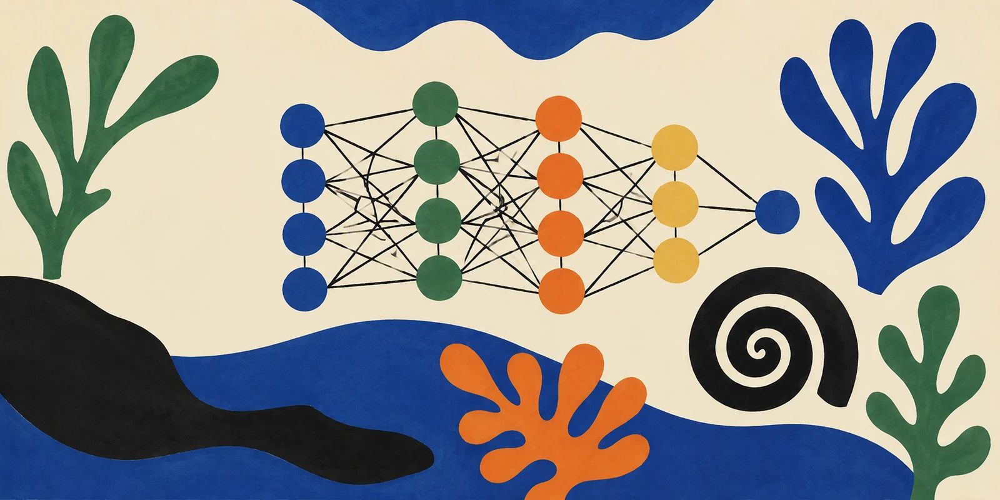

```{=html}
<div class="site-banner">
  
</div>
```

::: {.hero}
[LSE Summer School · 2026]{.eyebrow}

# AI & Deep Learning {#hero-title}

A three-week, hands-on introduction to deep learning and modern AI -- building from a single neuron to a working GPT you build yourself.

::: {.cta}
[Browse the lectures](lectures.qmd){.btn-cta}
[Go to the labs](labs.qmd){.btn-cta .secondary}
[Reading list](readings.qmd){.btn-cta .ghost}
:::
:::

## What you'll be able to do

By the end of the course you will be able to:

1. **Explain** what (deep) neural networks are and how they're trained.
2. **Build** neural networks from scratch in Python, then scale up with PyTorch.
3. **Apply** deep learning to predict, classify, and generate.
4. **Critique** AI systems — their assumptions, failure modes, and social consequences.

## The shape of the course

Each day pairs a **3-hour lecture** with a **90-minute lab**. The lectures build the ideas, which you then implement in the labs.

::: {.grid}

::: {.g-col-12 .g-col-md-4}
### [Week 1]{.week-pill} — Foundations
1. What do we mean by *AI*?
2. Deep models — a primer
3. Computational graphs & the maths of AI
4. Backpropagation
5. Feed-forward networks in PyTorch
:::

::: {.g-col-12 .g-col-md-4}
### [Week 2]{.week-pill} — Vision, generation & text
6. Classifying images (CNNs)
7. Generating images (VAEs, diffusion)
8. Text-gen 1/4 — embeddings & character models
9. Text-gen 2/4 — recurrent networks
:::

::: {.g-col-12 .g-col-md-4}
### [Week 3]{.week-pill} — Transformers & LLMs
10. Text-gen 3/4 — attention & transformers
11. Text-gen 4/4 — tokenisation & sampling
12. Ethics, limitations & recap
:::

:::

## Assessment

::: {.grid}
::: {.g-col-12 .g-col-md-4}
::: {.callout-tip appearance="minimal"}
**Formative quizzes** to help consolidate learning, without affecting your grade.
:::
:::
::: {.g-col-12 .g-col-md-4}
::: {.callout-tip appearance="minimal"}
**[Take-home midterm](midterm.qmd)** at the end of week 2 — train a model, document your choices, and discuss the results.
:::
:::
::: {.g-col-12 .g-col-md-4}
::: {.callout-tip appearance="minimal"}
**Final exam** — Friday 21 August, two hours, pen-and-paper.
:::
:::
:::

---

*Dr Thomas Robinson · Department of Methodology, LSE · Lab instructor: Dr Kaifang Zhou*
