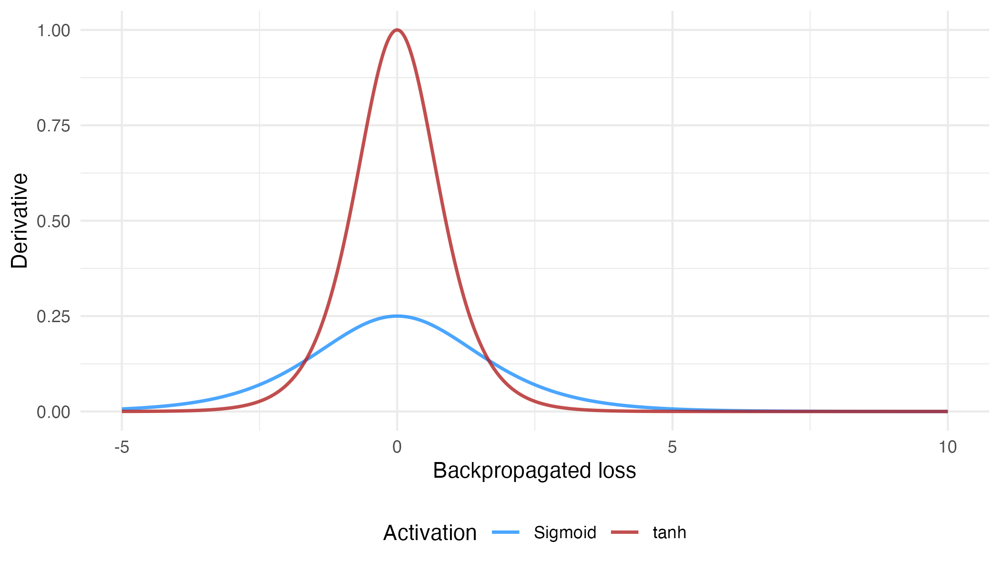
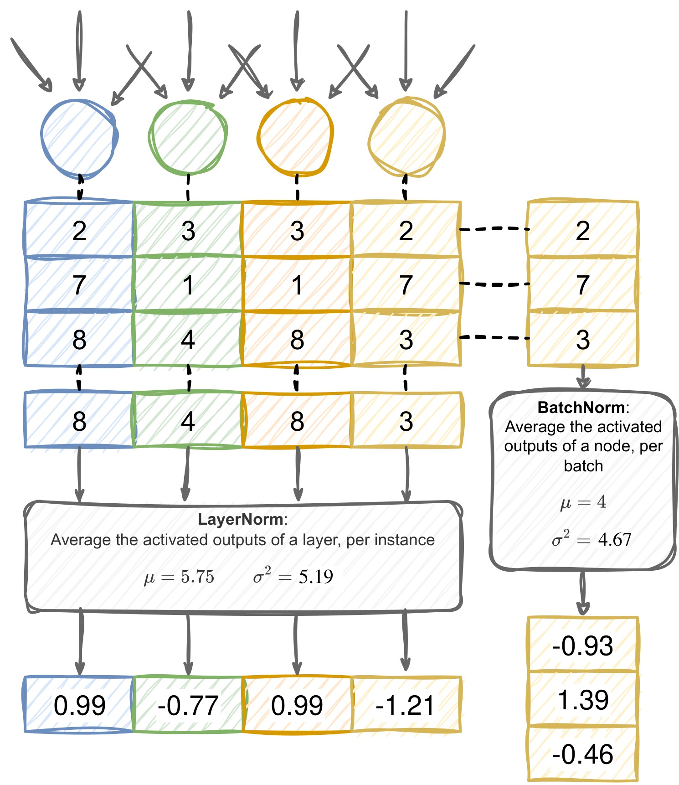

## Where are we?

[After yesterday's lecture]{.eyebrow}

::: {.card}
Four days writing autodifferentiation by hand. **From today, you never have to again** 

  * (except maybe in an exam 😉 )

**Question for today:**

How do we build neural networks at scale -- in PyTorch, on real data, with a working classifier?
:::

::: {.callout-tip}
# Concepts in practise 

Moving from "understanding the algorithm" to "building a useful model". 
:::

After today, every remaining lecture uses PyTorch.

## Warm-up · three questions from last time

[<span class="pause-cue">≈ 5 min</span> · shout it out]{.eyebrow}

::: {.card}
[From yesterday]{.eyebrow}

1. One gradient-descent update. $w = 1$, $\frac{\partial L}{\partial w} = 0.5$, learning rate $\lambda = 0.1$. What is the new $w$?
2. What does a loss function measure — and which loss did we use for continuous outcomes?
3. What do you backpropagate?
:::

[Everything here is from yesterday's lecture!]{.muted}

## Warm-up · answers

::: {.card}
1. Step against the gradient, scaled by $\lambda$:
$$
w_{\text{new}} = w - \lambda \frac{\partial L}{\partial w} = 1 - 0.1 \times 0.5 = 1 - 0.05 = 0.95
$$
2. How wrong the model's predictions are on the data, as a single number — lower is better. For regression we used **mean squared error**.
3. Often "the loss" but more technically you backpropagate the *gradient* of the loss
:::

# Part 1 · From `Value` to PyTorch {background-color="#0E1A2B"}

## What PyTorch gives us

::: {.card}
PyTorch is the autodiff library you built — only:

* **Faster** — runs on GPU.
* **More general** — operates on arbitrary tensors, not just scalars.
* **Better engineered** — handles edge cases, numerical stability, parallelism.

The mental model is identical to your `Value` library. Same forward pass. Same backward pass. Same parameters, gradients, and updates.
:::

::: {.callout-note}
The point of the last two days was to demystify what PyTorch does. Now we let it do that work for us — and we focus on **design** instead of bookkeeping.
:::

## Tensors — the building block

You have met tensors already in the labs:

```python
import torch

x = torch.tensor([1.0, 2.0, 3.0])             # 1-D tensor (a "vector")
W = torch.randn(4, 3)                          # 2-D tensor (a "matrix"), random-init
y = x @ W.T                                    # matrix multiplication
print(y.shape)                                 # torch.Size([4])
```

::: {.columns}
::: {.column width="50%"}
[Tensor properties]{.pill-blue}

* `.shape` — dimensions.
* `.dtype` — float32, int64, etc.
* `.device` — `cpu` or `cuda:0`.
* `.requires_grad` — should we track gradients?
:::
::: {.column width="50%"}
[Operations]{.pill}

* `@` or `torch.matmul` — matrix multiply.
* `+, -, *, /` — element-wise.
* `torch.exp`, `torch.log` — element-wise math.
* `.sum()`, `.mean()` — reductions.
:::
:::

## Autograd — backpropagation, automatically

```python
x = torch.tensor(2.0, requires_grad=True)
y = x ** 3 + 4 * x                  # y is a Value-like node — PyTorch builds the graph
y.backward()                        # backpropagate from y
print(x.grad)                       # → 16.0   (which is 3x² + 4 evaluated at x=2)
```

::: {.card}
**That is the whole API for autodiff in PyTorch.** 

* You can build any expression with tensors, it will automatically track the resulting graph.

* When you call `.backward()` on the scalar output tensor, you can then read off `.grad` from the inputs to see the results!

* This is exactly the algorithm you have been working on by hand.
:::

## PyTorch models — `nn.Module`

```python
import torch.nn as nn

class TurnoutModel(nn.Module):
    def __init__(self):
        super().__init__()
        self.fc1 = nn.Linear(3, 16)     # 3 inputs → 16 hidden neurons
        self.fc2 = nn.Linear(16, 1)     # 16 hidden → 1 output

    def forward(self, x):
        h = torch.relu(self.fc1(x))     # hidden layer with ReLU
        return self.fc2(h)              # output (logit)
```

::: {.card}
* `nn.Linear(k, h)` — a fully-connected layer with $k \cdot h$ weights and $h$ biases. Initialised for you.
* `nn.Module` — is a base class that tracks parameters and provides key methods like `.parameters()`, `.train()`, `.eval()`, `.to(device)`.
* `forward()` — defines what *you* mean by "run the model forward". PyTorch auto-builds the backward pass.
:::

## The same model, the quick way — `nn.Sequential`

When the network is just a straight stack of layers, you don't need to write a class at all. `nn.Sequential` chains modules and runs them in order:

```python
import torch.nn as nn

model = nn.Sequential(
    nn.Linear(3, 16),   # 3 inputs → 16 hidden
    nn.ReLU(),          # activation — now an explicit layer, not a function call
    nn.Linear(16, 1),   # 16 hidden → 1 output (logit)
)
```

::: {.card}
This is **exactly** the `TurnoutModel` from the previous slide — same layers, same forward pass, same parameters:

$$
\underbrace{3 \times 16 + 16}_{\text{layer 1} = 64} \;+\; \underbrace{16 \times 1 + 1}_{\text{layer 2} = 17} \;=\; \mathbf{81 \text{ parameters}}
$$

*The differences are cosmetic*

  * `torch.relu(...)` (a function) becomes `nn.ReLU()` (a layer object)
  * There is no `forward()` to write as `Sequential` calls each module in order.

Use `nn.Module` when the forward pass branches or reuses and `nn.Sequential` for simple, feedforward stacks.
:::

## A complete training script in 20 lines

```python
model     = TurnoutModel()
optimizer = torch.optim.Adam(model.parameters(), lr=1e-3)
loss_fn   = nn.BCEWithLogitsLoss()

for epoch in range(50):
    for x_batch, y_batch in train_loader:
        optimizer.zero_grad()
        y_logits = model(x_batch)                       # (B, 1) — a column
        loss = loss_fn(y_logits.squeeze(-1), y_batch)   # y_batch is (B,) — a row
        loss.backward()
        optimizer.step()
    print(f"Epoch {epoch:02d}: train loss = {loss.item():.3f}")
```

::: {.card}
**Every PyTorch training loop in the world** looks roughly like this.

We'll change what's *inside* the loop but the shape of this training protocol stays the same.
:::

::: {.callout-note appearance="simple"}
[Why `.squeeze(-1)`?]{.eyebrow}
The last layer is $16 \to 1$, so a batch of 32 comes out as shape **`(32, 1)`**. The labels arrive as **`(32,)`** — i.e. a flat vector.

* [This is annoying, but we need to "squeeze" the output so it is also `(32,)`.]{.smaller}
:::

## The same pattern

::: {.card}
1. **Define a model** (a `Module` whose `forward()` you wrote).
2. **Pick a loss function** (cross-entropy, MSE, …).
3. **Pick an optimiser** (Adam, SGD, …).
4. **For each batch in your training data**:
   a. Zero the gradients.
   b. Forward pass.
   c. Compute the loss.
   d. Backward pass.
   e. One optimiser step.
:::

## Activation functions — what they actually do

[A quick reminder why we need non-linearities]{.eyebrow}

Without non-linearities, stacking layers buys us nothing:
$$
\mathbf{x} \mathbf{W}^{(1)\mathsf T} \mathbf{W}^{(2)\mathsf T} \cdots \mathbf{W}^{(L)\mathsf T} = \mathbf{x} \mathbf{W}^*\mathsf{T}
$$

— still just a linear function of $\mathbf{x}$, regardless of $L$.


**Non-linear activations between layers are what gives deep learning its advantage**

  * They let the model bend, kink, and curve, not just separate with a single hyperplane.


## ReLU — the modern default

::: {.columns}
::: {.column width="55%"}
$$
\sigma_{\text{ReLU}}(x) = \max(0, x), \qquad \sigma'_{\text{ReLU}}(x) = \begin{cases} 1 & x > 0 \\ 0 & x < 0 \end{cases}
$$

* Cheap.
* No vanishing gradient on the positive side.
* Sparse activations — many nodes output exactly 0.

[The downside]{.pill-amber}

**Dead ReLUs.** If a neuron's pre-activation stays $\leq 0$, its gradient is always 0 — it stops learning.

Smoother variants (Leaky ReLU, GELU, SiLU) address this.
:::
::: {.column width="45%"}
::: {.card}
**Default choice in 2026**: use ReLU (or close cousin GELU) in hidden layers.

The overwhelming majority of feed-forward networks built in research do this. PyTorch: `nn.ReLU()`.
:::
:::
:::

## ReLU vs GELU — the same kink, smoothed

$$
\sigma_{\text{ReLU}}(x) = \max(0, x)
\qquad\qquad
\sigma_{\text{GELU}}(x) = x \cdot \Phi(x)
$$

[$\Phi$ is the **standard-normal cumulative distribution function**. GELU is just a softer version of ReLU.]{.smaller}

```{python}
#| echo: false
#| fig-width: 9
#| fig-height: 2.95
#| fig-align: center
import numpy as np
import matplotlib.pyplot as plt
import matplotlib_inline.backend_inline as backend_inline
from math import erf, sqrt

backend_inline.set_matplotlib_formats("svg")

# ME324 deck palette (see assets/theme/me324.scss)
INK, MUTED, RULE, PAPER = "#0E1A2B", "#5C6473", "#D7D2C5", "#FBFAF6"
RELU, GELU_C = "#C9322B", "#1A6FB4"

plt.rcParams.update({
    "font.family": "sans-serif",
    "font.sans-serif": ["Inter", "Helvetica Neue", "Arial", "DejaVu Sans"],
    "text.color": INK, "axes.labelcolor": INK,
    "xtick.color": MUTED, "ytick.color": MUTED, "axes.edgecolor": RULE,
})

# Phi = standard-normal CDF; phi = its density.  GELU(x) = x * Phi(x),
# so GELU'(x) = Phi(x) + x * phi(x). Values check out against
# torch.nn.functional.gelu to 4 dp.
Phi = np.vectorize(lambda t: 0.5 * (1.0 + erf(t / sqrt(2.0))))
phi = lambda t: np.exp(-t ** 2 / 2) / np.sqrt(2 * np.pi)

x = np.linspace(-4, 4, 800)
relu, gelu = np.maximum(0, x), x * Phi(x)
drelu, dgelu = (x > 0).astype(float), Phi(x) + x * phi(x)

fig, (ax1, ax2) = plt.subplots(1, 2, figsize=(9, 2.95))
fig.patch.set_alpha(0)                      # sit on the slide's own background

for ax in (ax1, ax2):
    ax.patch.set_alpha(0)
    ax.axhline(0, color=RULE, lw=1, zorder=1)
    ax.axvline(0, color=RULE, lw=1, zorder=1)
    ax.grid(True, color=RULE, lw=0.8, alpha=0.45)
    ax.set_axisbelow(True)
    ax.set_xlim(-4, 4)
    ax.set_xlabel("$x$", fontsize=11)
    for side in ("top", "right"):
        ax.spines[side].set_visible(False)

# ---- left: the activations themselves --------------------------------------
ax1.plot(x, relu, color=RELU, lw=2.6, zorder=3)
ax1.plot(x, gelu, color=GELU_C, lw=2.6, zorder=4)
ax1.set_ylim(-0.6, 4)
ax1.set_ylabel(r"$\sigma(x)$", fontsize=11)
ax1.set_title("the activation", fontsize=11, color=MUTED, pad=8)
# Direct labels, so identity never rests on colour alone.
ax1.annotate("ReLU", xy=(3.05, 3.05), xytext=(-4, 10), textcoords="offset points",
             color=RELU, fontsize=12, fontweight="bold", ha="right")
ax1.annotate("GELU", xy=(1.9, 1.85), xytext=(12, -15), textcoords="offset points",
             color=GELU_C, fontsize=12, fontweight="bold")
ax1.plot([-0.752], [-0.170], "o", color=GELU_C, ms=7, mec=PAPER, mew=1.6, zorder=5)
ax1.annotate("not monotonic — dips\nto $-0.17$ at $x=-0.75$", xy=(-0.752, -0.170),
             xytext=(-3.8, 1.45), color=GELU_C, fontsize=9.5, linespacing=1.35,
             arrowprops=dict(arrowstyle="->", color=GELU_C, lw=1.2, shrinkA=2, shrinkB=6,
                             connectionstyle="angle3,angleA=0,angleB=-70"))

# ---- right: the derivatives — where it actually matters --------------------
ax2.axvspan(-4, 0, color=RELU, alpha=0.05, zorder=0)
ax2.plot(x[x < 0], drelu[x < 0], color=RELU, lw=2.6, zorder=3)
ax2.plot(x[x > 0], drelu[x > 0], color=RELU, lw=2.6, zorder=3)
ax2.plot(x, dgelu, color=GELU_C, lw=2.6, zorder=4)
ax2.set_ylim(-0.42, 1.55)
ax2.set_ylabel(r"$\sigma'(x)$", fontsize=11)
ax2.set_title("its derivative — what backprop multiplies by",
              fontsize=11, color=MUTED, pad=8)
ax2.annotate("ReLU$'\\!=0$ for every negative $x$\na dead unit never returns",
             xy=(-2.0, 0.80), color=RELU, fontsize=9.5, ha="center",
             va="center", linespacing=1.35)
ax2.plot([-1], [-0.0833], "o", color=GELU_C, ms=7, mec=PAPER, mew=1.6, zorder=5)
ax2.annotate("GELU$'(-1) = -0.08$ — small,\nbut never exactly zero", xy=(-1, -0.0833),
             xytext=(0.15, -0.30), color=GELU_C, fontsize=9.5, linespacing=1.35,
             arrowprops=dict(arrowstyle="->", color=GELU_C, lw=1.2, shrinkA=2, shrinkB=5,
                             connectionstyle="angle3,angleA=0,angleB=60"))
ax2.annotate("ReLU$'\\!=1$", xy=(3.2, 1.0), xytext=(0, 9), textcoords="offset points",
             color=RELU, fontsize=10, ha="center")

plt.tight_layout()
plt.show()
```

::: {.card}
Since backprop multiplies by $\sigma'$, ReLU$'$ is a step -- exactly $0$ for every negative input. GELU$'$ is never exactly 0: at $x = -1$ it is $-0.083$.

Never really worth using GELU on a simple network, but very useful for transformers as we'll see later!
:::

## Sigmoid and tanh

::: {.columns}
::: {.column width="50%"}
[Sigmoid]{.pill-blue}

$$ \sigma(x) = \frac{1}{1 + e^{-x}}, \quad \sigma'(x) = \sigma(x)(1 - \sigma(x)) $$

* Squashes to $(0, 1)$ — natural for **binary probabilities**.
* Used at output of binary classifiers.
* In hidden layers: **vanishing gradients** (flat tails).
:::
::: {.column width="50%"}
[Tanh]{.pill-blue}

$$ \tanh(x), \quad \tanh'(x) = 1 - \tanh^2(x) $$

* Squashes to $(-1, 1)$ — zero-centred.
* Better than sigmoid for hidden layers, but still saturates.
* Used in RNNs (Day 9!) and a few specialised places.
:::
:::

## Identity, softmax — the output choices

::: {.columns}
::: {.column width="50%"}
[Identity]{.pill}

$$\sigma(x) = x$$

* For **regression** outputs — when $y$ lives on the whole real line.
* Never in hidden layers (except specialised cases).
:::
::: {.column width="50%"}
[Softmax]{.pill}

$$ \sigma_i(\mathbf{z}) = \frac{e^{z_i}}{\sum_j e^{z_j}} $$

* Squashes a vector of $k$ scores into a probability distribution over $k$ classes.
* Used at output of **multi-class classifiers**.
* Tied to **cross-entropy loss**.
:::
:::

::: {.card}
[Worked: softmax of $\mathbf{z} = [2, 1, 0]$]{.eyebrow}

Exponentiate each score, then divide by their sum:

$$
e^2 = 7.39, \quad e^1 = 2.72, \quad e^0 = 1.00, \quad \textstyle\sum = 11.11
$$

$$
\sigma(\mathbf{z}) = \left[\tfrac{7.39}{11.11},\ \tfrac{2.72}{11.11},\ \tfrac{1.00}{11.11}\right] = [0.67,\ 0.24,\ 0.09]
$$

Three positive numbers that sum to 1, i.e. a probability over three classes
:::

## A worked social-science example — civil-war forecasting

::: {.columns}
::: {.column width="55%"}
@hegre2022forecasting — *Forecasting fatalities*.

* Predict country-month battle-deaths from a rich set of features.
* A challenging benchmark in conflict studies.
* The reference model is a deep feed-forward network.

The input vector: country indicators, lagged casualties, conflict history, geographic features, economic indicators.

The output: a single number — the predicted log fatalities for the next month.
:::
::: {.column width="45%"}
::: {.card}
A reasonable architecture:

* Input: ~30 features.
* Hidden 1: 128 → ReLU → dropout 0.2.
* Hidden 2: 64 → ReLU → dropout 0.2.
* Output: 1 (identity).

Train with **MSE** loss and **Adam** at $\lambda = 10^{-3}$ for ~100 epochs.

This is exactly the kind of model you'll build in today's lab.
:::
:::
:::

# Plenary · predict what each activation does {background-color="#0E1A2B"}

## Plenary · predict the activations

[<span class="pause-cue">≈ 10 min</span> · in pairs]{.eyebrow}

::: {.card}
[The pre-activation value:]{.eyebrow}

$z = -3.5$

For each activation, compute (or estimate) the post-activation value $\sigma(z)$:

1. **Identity** — $\sigma(z) = z$
2. **ReLU** — $\sigma(z) = \max(0, z)$
3. **Sigmoid** — $\sigma(z) = 1/(1 + e^{-z})$
4. **tanh** — $\sigma(z) = (e^{2z} - 1)/(e^{2z} + 1)$

Then for each, give the **derivative** at $z = -3.5$.

* Why does it matter that ReLU gives a 0 derivative and identity gives a derivative of exactly 1, while sigmoid/tanh give tiny derivatives?
:::

## Plenary · answers

::: {.card}
| Activation | $\sigma(-3.5)$ | $\sigma'(-3.5)$ |
|---|---|---|
| Identity | $-3.5$ | $1$ |
| ReLU | $0$ | $0$ |
| Sigmoid | $\approx 0.029$ | $\approx 0.028$ |
| tanh | $\approx -0.998$ | $\approx 0.004$ |
:::

::: {.reveal-box}
[Takeaways]{.reveal-label}
On the negative side at $|z| = 3.5$:

* **Identity** passes through, with derivative 1 → great for gradient flow.
* **ReLU** zeroes out — and its gradient is also zero on this example. If the unit stays negative for *every* input, it becomes a *dead ReLU* and stops learning permanently.
* **Sigmoid / tanh** are nearly flat — derivative $\to 0$. **Vanishing gradient.** Backprop through many such nodes shrinks gradients to nothing.

:::

# Part 2 · Training models properly {background-color="#0E1A2B"}

## Loss functions, by problem type

| Problem | Output activation *(applied inside the loss — don't add it yourself)* | Loss in PyTorch |
|---|---|---|
| Regression (continuous) | identity | `nn.MSELoss` |
| Binary classification | sigmoid | `nn.BCEWithLogitsLoss` |
| Multi-class classification | softmax | `nn.CrossEntropyLoss` |
| Multi-label | sigmoid per class | `nn.BCEWithLogitsLoss` |

::: {.callout-tip}
`BCEWithLogitsLoss` and `CrossEntropyLoss` **bundle** the sigmoid/softmax with the loss so *don't apply the sigmoid activation yourself*. This combined version is more stable.
:::

## Initialisation — why "all zeros" fails

::: {.try-box}
[Predict]{.try-label}
**Suppose we set *every* weight to exactly 0 before training. What goes wrong on the first step — and could training ever recover?**

:::

::: {.fragment}
::: {.reveal-box}
[Answer — the symmetry trap]{.reveal-label}

If every weight starts at 0:

* Every node in a layer gets the same input × same weights → the **same output**.
* Every node gets the **same gradient**, so every node **updates identically**.
* The network is effectively **one node wide** — symmetry never breaks, no matter how long you train.

**Random initialisation breaks the symmetry.** But the *scale* matters too: too big and activations explode; too small and they vanish — the same vanishing/exploding problem we saw with sigmoid, now driven by the *weights*, not the activation.
:::
:::

## Xavier and He initialisation

::: {.columns}
::: {.column width="50%"}
[Xavier (Glorot)]{.pill-blue}

For sigmoid / tanh:
$$ W^{(l)} \sim \mathcal{N}\!\left(0, \tfrac{2}{n^{(l-1)} + n^{(l)}}\right) $$

Keeps the variance of activations stable across layers. 

When the layer's input and output dimensions are similar this reduces to the "fan-in" (LeCun) form $\tfrac{1}{n^{(l-1)}}$.
:::
::: {.column width="50%"}
[He (Kaiming)]{.pill}

For ReLU:
$$ W^{(l)} \sim \mathcal{N}(0, \tfrac{2}{n^{(l-1)}}) $$

The factor of 2 compensates for the half of the distribution ReLU zeroes out.
:::
:::

::: {.callout-tip}
# You won't usually set this by hand.
PyTorch's `nn.Linear` defaults to a Kaiming-uniform variant. You should know this is happening but only override it if you have a reason.
:::

## Optimisers — what we'll actually use

::: {.columns}
::: {.column width="50%"}
* **SGD** — vanilla. Rarely best in practice.
* **SGD with momentum** — better, still simple.
* **Adam** — adaptive learning rates per parameter. **Default first try.**
* **AdamW** — Adam with corrected weight decay. Default for transformers.
:::
::: {.column width="50%"}
[Learning rate]{.eyebrow}

* Most important hyperparameter you'll set.
* Reasonable starting points:
  * Adam: $\lambda = 10^{-3}$
  * SGD: $\lambda = 10^{-2}$
* Too high → loss explodes.
* Too low → loss crawls.
:::
:::

::: {.callout-tip}
# Modern practice 
Use Adam with $\lambda = 10^{-3}$, then tune as needed.
:::

## Monitoring training

```{python}
#| eval: false
#| echo: true
import torch
from torch.utils.data import DataLoader

model     = MyModel()                                    # nn.Module
loss_fn   = nn.CrossEntropyLoss()
optimizer = torch.optim.Adam(model.parameters(), lr=1e-3)

train_loader = DataLoader(train_set, batch_size=64, shuffle=True)
val_loader   = DataLoader(val_set,   batch_size=64)

for epoch in range(num_epochs):
    model.train()
    for x_batch, y_batch in train_loader:
        optimizer.zero_grad()
        y_pred = model(x_batch)
        loss   = loss_fn(y_pred, y_batch)
        loss.backward()
        optimizer.step()

    model.eval()
    with torch.no_grad():
        val_loss = sum(loss_fn(model(x), y) for x, y in val_loader) / len(val_loader)
    print(f"Epoch {epoch:02d}: train={loss.item():.3f} val={val_loss.item():.3f}")
```

## What's new in this version

::: {.card}
* `model.train()` / `model.eval()` — toggles dropout and batch-norm behaviour (we'll see why in Part 3).
* `torch.no_grad()` — disables gradient tracking during evaluation (saves memory and time).
* **Validation loss** — computed every epoch on held-out data.
:::

::: {.callout-warning}
# Never compute training and validation loss without toggling train/eval
During training, several neural network features will operate differently than during testing (we'll introduce some of these soon).
:::

# Activity · adjust one toggle, predict the effect {background-color="#0E1A2B"}

## Activity · predict the effect

[<span class="pause-cue">≈ 8 min</span> · in pairs]{.eyebrow}

For each change, **predict** what happens to (a) training loss and (b) validation loss, then justify:

::: {.card}
1. You **increase the learning rate** from $10^{-3}$ to $10^{-1}$.

2. You **add a third hidden layer** (200 nodes wide).

3. You **drop the activation function** from all hidden layers — set $\sigma$ to identity everywhere.

4. You **freeze the first hidden layer** — it doesn't update during training.
:::

## Activity · answers

::: {.card}
1. **Higher LR.** Training loss might *explode* — overshoots minima. If it doesn't explode, it may converge faster but more noisily. Validation loss tends to mirror.

2. **Deeper model.** Train loss → lower (more capacity to fit training data). Val loss → uncertain depending on data and model specification (more on this later).

3. **No activations.** Both losses suffer dramatically. The model is now linear regression with extra parameters — same hypothesis class, more parameters to wiggle. Converges to the optimal linear fit.

4. **Frozen first layer.** With random init, the first layer is essentially a fixed random projection. Sometimes still works ("random kitchen sinks"), but typically losses both rise vs. the unfrozen model.
:::

# Part 3 · When training fails {background-color="#0E1A2B"}

## What you need to know

[<span class="pause-cue">Stop & check</span>]{.eyebrow}

::: {.card}
Before we go on to understand when models *break*, make sure you're happy with the following:

1. Why does **initialising every weight to zero** stop the network from learning?
2. What does **`model.eval()`** change about dropout and batch norm?
3. Which optimiser and learning rate are the sensible **first try**?
:::

[If any of these are still fuzzy, flag it now!]{.muted}

## Neural networks are fickle

Even with the right loss, the right optimiser, and the right init, training can:

::: {.columns}
::: {.column width="50%"}
* **Diverge** — loss explodes to infinity.
* **Stall** — loss stops decreasing too early.
* **Overfit** — train loss → 0, validation loss climbs.
* **Underfit** — neither loss falls usefully.
:::
::: {.column width="50%"}
::: {.callout-warning}
**You will encounter all of these** in the labs this week. The point of this section is to give you the vocabulary to *diagnose* what's happening — not to fix everything in one go.
:::
:::
:::

## Problem 1 — overfitting

::: {.columns}
::: {.column width="55%"}
Neural networks have many parameters. They can **memorise** the training set if you let them.

* Training loss → 0.
* Validation loss starts climbing.
* The model has fit *noise* in the training data, not signal.

::: {.callout-tip}
The diagnostic is the gap between training and validation loss curves — watch them every epoch.
:::
:::
::: {.column width="45%"}
[Defences]{.pill-blue}

* Hold out a validation set.
* **Early stopping** — stop when val loss bottoms out.
* **Dropout** — random masking.
* **Weight decay** — penalise large weights.
* **More data** — when available.
* **Smaller model** — when you can't get more data.
:::
:::

## Dropout

During training, with probability $p$, **zero out** each node's output:

::: {.columns}
::: {.column width="47%"}
::: {.card}
* Forces the network to learn **redundant representations**.
* Acts like an implicit **ensemble** of thinned sub-networks.
* Standard: $p = 0.2$–$0.5$ on hidden layers; **never** on the output.
* In PyTorch: `nn.Dropout(p=0.2)` after an (activated) layer.

[**Dropout is turned off at inference**]{.eyebrow}

  * `model.eval()` scales the learned weights as a result
:::
:::
::: {.column width="53%"}
```{dot}
//| fig-width: 4.05
//| fig-height: 5.4
digraph G {
  rankdir="LR"; bgcolor="transparent"; node [fontname="Inter"];
  x [shape=record label="x"];
  h1 [shape=circle label="h₁" style=filled fillcolor="#F4F1EA"];
  h2 [shape=circle label="h₂" style=filled fillcolor="#F4F1EA"];
  h3 [shape=circle label="h₃" style=filled fillcolor="#C58A12" fontcolor="white"];
  h4 [shape=circle label="h₄" style=filled fillcolor="#F4F1EA"];
  h5 [shape=circle label="h₅" style=filled fillcolor="#C58A12" fontcolor="white"];
  y [shape=record label="y"];
  x -> h1; x -> h2; x -> h3; x -> h4; x -> h5;
  h1 -> y; h2 -> y; h3 -> y [color="gray80"]; h4 -> y; h5 -> y [color="gray80"];
}
```

[Amber units are the ones dropped on *this* step — a fresh random set every batch.]{.smaller .muted}
:::
:::

## Problem 2 — vanishing gradients

::: {.columns}
::: {.column width="50%"}
For sigmoid / tanh:

* Their derivatives are nearly zero for large $|z|$.
* Backprop multiplies many derivatives via the chain rule.
* In a deep network this product results in **shrinking gradients**.
* Gradients near the input layer effectively vanish.
* Early layers stop learning.
:::
::: {.column width="50%"}
{fig-align="center"}
:::
:::

[Fixes]{.eyebrow}

1. **Use ReLU-family activations** (no flat tail for $z > 0$).
2. **Normalise** activations across the network → next slide.

## Batch normalisation — the idea [@batchnorm]

Every layer learns against a moving target: as the layers *before* it update, the distribution arriving at this one shifts.

::: {.card}
[The fix]{.eyebrow}
After a layer's pre-activation, **rescale each feature so that — across the examples in the mini-batch — it has mean 0 and variance 1.**
:::

$$
\text{BN}(z) = \gamma \cdot \underbrace{\frac{z - \mu_B}{\sqrt{\sigma_B^2 + \epsilon}}}_{\text{standardise}} + \beta
$$

[$\mu_B, \sigma_B^2$ — mean and variance of **this one feature**, over the examples in the batch. $\gamma, \beta$ are learnable scale and shift parameters, one pair per feature.]{.smaller}

::: {.try-box}
[Stop & check]{.try-label}
A batch of **32** examples enters a hidden layer of width **64**. How many means $\mu_B$ does batch norm compute?
:::

::: {.fragment}
::: {.reveal-box}
[Answer]{.reveal-label}
**64** — one per *feature*, each averaged over the 32 examples. The batch is the dimension we average **away**.
:::
:::

## Batch normalisation example

[One click per step — batch norm reads **down a column**]{.eyebrow}

A batch of three examples (rows), each with four features (columns). Take feature 1, with $\gamma = 1$ and $\beta = 0$.

::: {.r-stack}

```{dot}
//| fig-height: 3.1
digraph BN0 {
  bgcolor="#FBFAF6"; nodesep=0.1; ranksep=0.28;
  node [fontname="Inter" shape=plaintext fontcolor="#0E1A2B"];
  m [label=<<TABLE BORDER="0" CELLBORDER="1" CELLSPACING="0" CELLPADDING="6"><TR><TD BORDER="0"></TD><TD BGCOLOR="#F4F1EA" COLOR="#D7D2C5" BORDER="2">f<SUB>1</SUB></TD><TD BGCOLOR="#F4F1EA" COLOR="#D7D2C5">f<SUB>2</SUB></TD><TD BGCOLOR="#F4F1EA" COLOR="#D7D2C5">f<SUB>3</SUB></TD><TD BGCOLOR="#F4F1EA" COLOR="#D7D2C5">f<SUB>4</SUB></TD></TR><TR><TD BORDER="0"><FONT COLOR="#5C6473">ex 1</FONT></TD><TD BORDER="2" ALIGN="LEFT" COLOR="#D7D2C5"><FONT COLOR="#0E1A2B">2</FONT><FONT COLOR="#FBFAF6">&#160;&#8594;&#160;&#8722;1.22</FONT></TD><TD COLOR="#D7D2C5">4</TD><TD COLOR="#D7D2C5">6</TD><TD COLOR="#D7D2C5">8</TD></TR><TR><TD BORDER="0"><FONT COLOR="#5C6473">ex 2</FONT></TD><TD BORDER="2" ALIGN="LEFT" COLOR="#D7D2C5"><FONT COLOR="#0E1A2B">4</FONT><FONT COLOR="#FBFAF6">&#160;&#8594;&#160;0.00</FONT></TD><TD COLOR="#D7D2C5">0</TD><TD COLOR="#D7D2C5">2</TD><TD COLOR="#D7D2C5">6</TD></TR><TR><TD BORDER="0"><FONT COLOR="#5C6473">ex 3</FONT></TD><TD BORDER="2" ALIGN="LEFT" COLOR="#D7D2C5"><FONT COLOR="#0E1A2B">6</FONT><FONT COLOR="#FBFAF6">&#160;&#8594;&#160;+1.22</FONT></TD><TD COLOR="#D7D2C5">2</TD><TD COLOR="#D7D2C5">4</TD><TD COLOR="#D7D2C5">4</TD></TR></TABLE>>];
  cap [label=<<TABLE BORDER="0" CELLBORDER="0" CELLSPACING="0" CELLPADDING="4"><TR><TD ALIGN="LEFT"><FONT COLOR="#FBFAF6">Step 1 &#183; the batch mean:&#160; (2 + 4 + 6) / 3 = 4</FONT></TD></TR><TR><TD ALIGN="LEFT"><FONT COLOR="#FBFAF6">Step 2 &#183; the batch variance:&#160; ((&#8722;2)&#178; + 0&#178; + (+2)&#178;) / 3 = 8/3 &#8776; 2.67,&#160; so the sd &#8776; 1.63</FONT></TD></TR><TR><TD ALIGN="LEFT"><FONT COLOR="#FBFAF6">Step 3 &#183; standardise:&#160; (2 &#8722; 4)/1.63 = &#8722;1.22,&#160;&#160; (4 &#8722; 4)/1.63 = 0.00,&#160;&#160; (6 &#8722; 4)/1.63 = +1.22</FONT></TD></TR></TABLE>>];
  m -> cap [style=invis];
}
```

::: {.fragment}
```{dot}
//| fig-height: 3.1
digraph BN1 {
  bgcolor="#FBFAF6"; nodesep=0.1; ranksep=0.28;
  node [fontname="Inter" shape=plaintext fontcolor="#0E1A2B"];
  m [label=<<TABLE BORDER="0" CELLBORDER="1" CELLSPACING="0" CELLPADDING="6"><TR><TD BORDER="0"></TD><TD BGCOLOR="#F4F1EA" COLOR="#C9322B" BORDER="2">f<SUB>1</SUB></TD><TD BGCOLOR="#F4F1EA" COLOR="#D7D2C5">f<SUB>2</SUB></TD><TD BGCOLOR="#F4F1EA" COLOR="#D7D2C5">f<SUB>3</SUB></TD><TD BGCOLOR="#F4F1EA" COLOR="#D7D2C5">f<SUB>4</SUB></TD></TR><TR><TD BORDER="0"><FONT COLOR="#5C6473">ex 1</FONT></TD><TD BORDER="2" ALIGN="LEFT" COLOR="#C9322B"><FONT COLOR="#C9322B">2</FONT><FONT COLOR="#FBFAF6">&#160;&#8594;&#160;&#8722;1.22</FONT></TD><TD COLOR="#D7D2C5">4</TD><TD COLOR="#D7D2C5">6</TD><TD COLOR="#D7D2C5">8</TD></TR><TR><TD BORDER="0"><FONT COLOR="#5C6473">ex 2</FONT></TD><TD BORDER="2" ALIGN="LEFT" COLOR="#C9322B"><FONT COLOR="#C9322B">4</FONT><FONT COLOR="#FBFAF6">&#160;&#8594;&#160;0.00</FONT></TD><TD COLOR="#D7D2C5">0</TD><TD COLOR="#D7D2C5">2</TD><TD COLOR="#D7D2C5">6</TD></TR><TR><TD BORDER="0"><FONT COLOR="#5C6473">ex 3</FONT></TD><TD BORDER="2" ALIGN="LEFT" COLOR="#C9322B"><FONT COLOR="#C9322B">6</FONT><FONT COLOR="#FBFAF6">&#160;&#8594;&#160;+1.22</FONT></TD><TD COLOR="#D7D2C5">2</TD><TD COLOR="#D7D2C5">4</TD><TD COLOR="#D7D2C5">4</TD></TR></TABLE>>];
  cap [label=<<TABLE BORDER="0" CELLBORDER="0" CELLSPACING="0" CELLPADDING="4"><TR><TD ALIGN="LEFT"><FONT COLOR="#0E1A2B">Step 1 &#183; the batch mean:&#160; (2 + 4 + 6) / 3 = 4</FONT></TD></TR><TR><TD ALIGN="LEFT"><FONT COLOR="#FBFAF6">Step 2 &#183; the batch variance:&#160; ((&#8722;2)&#178; + 0&#178; + (+2)&#178;) / 3 = 8/3 &#8776; 2.67,&#160; so the sd &#8776; 1.63</FONT></TD></TR><TR><TD ALIGN="LEFT"><FONT COLOR="#FBFAF6">Step 3 &#183; standardise:&#160; (2 &#8722; 4)/1.63 = &#8722;1.22,&#160;&#160; (4 &#8722; 4)/1.63 = 0.00,&#160;&#160; (6 &#8722; 4)/1.63 = +1.22</FONT></TD></TR></TABLE>>];
  m -> cap [style=invis];
}
```
:::

::: {.fragment}
```{dot}
//| fig-height: 3.1
digraph BN2 {
  bgcolor="#FBFAF6"; nodesep=0.1; ranksep=0.28;
  node [fontname="Inter" shape=plaintext fontcolor="#0E1A2B"];
  m [label=<<TABLE BORDER="0" CELLBORDER="1" CELLSPACING="0" CELLPADDING="6"><TR><TD BORDER="0"></TD><TD BGCOLOR="#F4F1EA" COLOR="#C9322B" BORDER="2">f<SUB>1</SUB></TD><TD BGCOLOR="#F4F1EA" COLOR="#D7D2C5">f<SUB>2</SUB></TD><TD BGCOLOR="#F4F1EA" COLOR="#D7D2C5">f<SUB>3</SUB></TD><TD BGCOLOR="#F4F1EA" COLOR="#D7D2C5">f<SUB>4</SUB></TD></TR><TR><TD BORDER="0"><FONT COLOR="#5C6473">ex 1</FONT></TD><TD BORDER="2" ALIGN="LEFT" COLOR="#C9322B"><FONT COLOR="#C9322B">2</FONT><FONT COLOR="#FBFAF6">&#160;&#8594;&#160;&#8722;1.22</FONT></TD><TD COLOR="#D7D2C5">4</TD><TD COLOR="#D7D2C5">6</TD><TD COLOR="#D7D2C5">8</TD></TR><TR><TD BORDER="0"><FONT COLOR="#5C6473">ex 2</FONT></TD><TD BORDER="2" ALIGN="LEFT" COLOR="#C9322B"><FONT COLOR="#C9322B">4</FONT><FONT COLOR="#FBFAF6">&#160;&#8594;&#160;0.00</FONT></TD><TD COLOR="#D7D2C5">0</TD><TD COLOR="#D7D2C5">2</TD><TD COLOR="#D7D2C5">6</TD></TR><TR><TD BORDER="0"><FONT COLOR="#5C6473">ex 3</FONT></TD><TD BORDER="2" ALIGN="LEFT" COLOR="#C9322B"><FONT COLOR="#C9322B">6</FONT><FONT COLOR="#FBFAF6">&#160;&#8594;&#160;+1.22</FONT></TD><TD COLOR="#D7D2C5">2</TD><TD COLOR="#D7D2C5">4</TD><TD COLOR="#D7D2C5">4</TD></TR></TABLE>>];
  cap [label=<<TABLE BORDER="0" CELLBORDER="0" CELLSPACING="0" CELLPADDING="4"><TR><TD ALIGN="LEFT"><FONT COLOR="#5C6473">Step 1 &#183; the batch mean:&#160; (2 + 4 + 6) / 3 = 4</FONT></TD></TR><TR><TD ALIGN="LEFT"><FONT COLOR="#0E1A2B">Step 2 &#183; the batch variance:&#160; ((&#8722;2)&#178; + 0&#178; + (+2)&#178;) / 3 = 8/3 &#8776; 2.67,&#160; so the sd &#8776; 1.63</FONT></TD></TR><TR><TD ALIGN="LEFT"><FONT COLOR="#FBFAF6">Step 3 &#183; standardise:&#160; (2 &#8722; 4)/1.63 = &#8722;1.22,&#160;&#160; (4 &#8722; 4)/1.63 = 0.00,&#160;&#160; (6 &#8722; 4)/1.63 = +1.22</FONT></TD></TR></TABLE>>];
  m -> cap [style=invis];
}
```
:::

::: {.fragment}
```{dot}
//| fig-height: 3.1
digraph BN3 {
  bgcolor="#FBFAF6"; nodesep=0.1; ranksep=0.28;
  node [fontname="Inter" shape=plaintext fontcolor="#0E1A2B"];
  m [label=<<TABLE BORDER="0" CELLBORDER="1" CELLSPACING="0" CELLPADDING="6"><TR><TD BORDER="0"></TD><TD BGCOLOR="#F4F1EA" COLOR="#1A6FB4" BORDER="2">f<SUB>1</SUB></TD><TD BGCOLOR="#F4F1EA" COLOR="#D7D2C5">f<SUB>2</SUB></TD><TD BGCOLOR="#F4F1EA" COLOR="#D7D2C5">f<SUB>3</SUB></TD><TD BGCOLOR="#F4F1EA" COLOR="#D7D2C5">f<SUB>4</SUB></TD></TR><TR><TD BORDER="0"><FONT COLOR="#5C6473">ex 1</FONT></TD><TD BORDER="2" ALIGN="LEFT" COLOR="#1A6FB4"><FONT COLOR="#0E1A2B">2</FONT><FONT COLOR="#1A6FB4">&#160;&#8594;&#160;&#8722;1.22</FONT></TD><TD COLOR="#D7D2C5">4</TD><TD COLOR="#D7D2C5">6</TD><TD COLOR="#D7D2C5">8</TD></TR><TR><TD BORDER="0"><FONT COLOR="#5C6473">ex 2</FONT></TD><TD BORDER="2" ALIGN="LEFT" COLOR="#1A6FB4"><FONT COLOR="#0E1A2B">4</FONT><FONT COLOR="#1A6FB4">&#160;&#8594;&#160;0.00</FONT></TD><TD COLOR="#D7D2C5">0</TD><TD COLOR="#D7D2C5">2</TD><TD COLOR="#D7D2C5">6</TD></TR><TR><TD BORDER="0"><FONT COLOR="#5C6473">ex 3</FONT></TD><TD BORDER="2" ALIGN="LEFT" COLOR="#1A6FB4"><FONT COLOR="#0E1A2B">6</FONT><FONT COLOR="#1A6FB4">&#160;&#8594;&#160;+1.22</FONT></TD><TD COLOR="#D7D2C5">2</TD><TD COLOR="#D7D2C5">4</TD><TD COLOR="#D7D2C5">4</TD></TR></TABLE>>];
  cap [label=<<TABLE BORDER="0" CELLBORDER="0" CELLSPACING="0" CELLPADDING="4"><TR><TD ALIGN="LEFT"><FONT COLOR="#5C6473">Step 1 &#183; the batch mean:&#160; (2 + 4 + 6) / 3 = 4</FONT></TD></TR><TR><TD ALIGN="LEFT"><FONT COLOR="#5C6473">Step 2 &#183; the batch variance:&#160; ((&#8722;2)&#178; + 0&#178; + (+2)&#178;) / 3 = 8/3 &#8776; 2.67,&#160; so the sd &#8776; 1.63</FONT></TD></TR><TR><TD ALIGN="LEFT"><FONT COLOR="#0E1A2B">Step 3 &#183; standardise:&#160; (2 &#8722; 4)/1.63 = &#8722;1.22,&#160;&#160; (4 &#8722; 4)/1.63 = 0.00,&#160;&#160; (6 &#8722; 4)/1.63 = +1.22</FONT></TD></TR></TABLE>>];
  m -> cap [style=invis];
}
```
:::

:::

[Features 2–4 get the same treatment, each with its own $\mu_B$ and $\sigma_B$ — 64 features means 64 means.]{.smaller .muted}

## What batch norm buys you

* Because $\gamma, \beta$ are *learned*, the network can **undo** the standardisation if the original scale was useful!

::: {.card}
[Why it helps]{.eyebrow}

Stabilises activations across layers, stops distributions drifting during training, makes initialisation less critical, lets you use a larger learning rate.
:::

::: {.callout-warning appearance="simple"}
# At test time there is no batch to average over

During prediction, batch norm switches to **running averages** collected during training. That is one of the two things `model.eval()` toggles — and why forgetting it changes your numbers.
:::

## Layer normalisation

[Same arithmetic. Same matrix. Different direction — layer norm reads **along a row**.]{.eyebrow}

$$
\text{LN}(h) = \gamma \cdot \frac{h - \mu_L}{\sqrt{\sigma_L^2 + \epsilon}} + \beta
$$

[$\mu_L, \sigma_L^2$ come from the $d$ features **of one example** — here $h = [2,\ 4,\ 6,\ 8]$. Nothing is shared across the batch.]{.smaller}

::: {.r-stack}

```{dot}
//| fig-height: 3.0
digraph LN0 {
  bgcolor="#FBFAF6"; nodesep=0.1; ranksep=0.28;
  node [fontname="Inter" shape=plaintext fontcolor="#0E1A2B"];
  m [label=<<TABLE BORDER="0" CELLBORDER="1" CELLSPACING="0" CELLPADDING="6"><TR><TD BORDER="0"></TD><TD BGCOLOR="#F4F1EA" COLOR="#D7D2C5">f<SUB>1</SUB></TD><TD BGCOLOR="#F4F1EA" COLOR="#D7D2C5">f<SUB>2</SUB></TD><TD BGCOLOR="#F4F1EA" COLOR="#D7D2C5">f<SUB>3</SUB></TD><TD BGCOLOR="#F4F1EA" COLOR="#D7D2C5">f<SUB>4</SUB></TD></TR><TR><TD BORDER="0"><FONT COLOR="#D7D2C5">ex 1</FONT></TD><TD BORDER="2" COLOR="#D7D2C5"><FONT COLOR="#0E1A2B">2</FONT><FONT COLOR="#FBFAF6">&#160;&#8594;&#160;&#8722;1.34</FONT></TD><TD BORDER="2" COLOR="#D7D2C5"><FONT COLOR="#0E1A2B">4</FONT><FONT COLOR="#FBFAF6">&#160;&#8594;&#160;&#8722;0.45</FONT></TD><TD BORDER="2" COLOR="#D7D2C5"><FONT COLOR="#0E1A2B">6</FONT><FONT COLOR="#FBFAF6">&#160;&#8594;&#160;+0.45</FONT></TD><TD BORDER="2" COLOR="#D7D2C5"><FONT COLOR="#0E1A2B">8</FONT><FONT COLOR="#FBFAF6">&#160;&#8594;&#160;+1.34</FONT></TD></TR><TR><TD BORDER="0"><FONT COLOR="#5C6473">ex 2</FONT></TD><TD COLOR="#D7D2C5">4</TD><TD COLOR="#D7D2C5">0</TD><TD COLOR="#D7D2C5">2</TD><TD COLOR="#D7D2C5">6</TD></TR><TR><TD BORDER="0"><FONT COLOR="#5C6473">ex 3</FONT></TD><TD COLOR="#D7D2C5">6</TD><TD COLOR="#D7D2C5">2</TD><TD COLOR="#D7D2C5">4</TD><TD COLOR="#D7D2C5">4</TD></TR></TABLE>>];
  cap [label=<<TABLE BORDER="0" CELLBORDER="0" CELLSPACING="0" CELLPADDING="4"><TR><TD ALIGN="LEFT"><FONT COLOR="#FBFAF6">Step 1 &#183; the feature mean:&#160; (2 + 4 + 6 + 8) / 4 = 5</FONT></TD></TR><TR><TD ALIGN="LEFT"><FONT COLOR="#FBFAF6">Step 2 &#183; the feature variance:&#160; ((&#8722;3)&#178; + (&#8722;1)&#178; + (+1)&#178; + (+3)&#178;) / 4 = 20/4 = 5,&#160; so the sd &#8776; 2.24</FONT></TD></TR><TR><TD ALIGN="LEFT"><FONT COLOR="#FBFAF6">Step 3 &#183; standardise:&#160; &#8722;3/2.24 = &#8722;1.34,&#160;&#160; &#8722;1/2.24 = &#8722;0.45,&#160;&#160; +1/2.24 = +0.45,&#160;&#160; +3/2.24 = +1.34</FONT></TD></TR></TABLE>>];
  m -> cap [style=invis];
}
```

::: {.fragment}
```{dot}
//| fig-height: 3.0
digraph LN1 {
  bgcolor="#FBFAF6"; nodesep=0.1; ranksep=0.28;
  node [fontname="Inter" shape=plaintext fontcolor="#0E1A2B"];
  m [label=<<TABLE BORDER="0" CELLBORDER="1" CELLSPACING="0" CELLPADDING="6"><TR><TD BORDER="0"></TD><TD BGCOLOR="#F4F1EA" COLOR="#D7D2C5">f<SUB>1</SUB></TD><TD BGCOLOR="#F4F1EA" COLOR="#D7D2C5">f<SUB>2</SUB></TD><TD BGCOLOR="#F4F1EA" COLOR="#D7D2C5">f<SUB>3</SUB></TD><TD BGCOLOR="#F4F1EA" COLOR="#D7D2C5">f<SUB>4</SUB></TD></TR><TR><TD BORDER="0"><FONT COLOR="#C9322B">ex 1</FONT></TD><TD BORDER="2" COLOR="#C9322B"><FONT COLOR="#C9322B">2</FONT><FONT COLOR="#FBFAF6">&#160;&#8594;&#160;&#8722;1.34</FONT></TD><TD BORDER="2" COLOR="#C9322B"><FONT COLOR="#C9322B">4</FONT><FONT COLOR="#FBFAF6">&#160;&#8594;&#160;&#8722;0.45</FONT></TD><TD BORDER="2" COLOR="#C9322B"><FONT COLOR="#C9322B">6</FONT><FONT COLOR="#FBFAF6">&#160;&#8594;&#160;+0.45</FONT></TD><TD BORDER="2" COLOR="#C9322B"><FONT COLOR="#C9322B">8</FONT><FONT COLOR="#FBFAF6">&#160;&#8594;&#160;+1.34</FONT></TD></TR><TR><TD BORDER="0"><FONT COLOR="#5C6473">ex 2</FONT></TD><TD COLOR="#D7D2C5">4</TD><TD COLOR="#D7D2C5">0</TD><TD COLOR="#D7D2C5">2</TD><TD COLOR="#D7D2C5">6</TD></TR><TR><TD BORDER="0"><FONT COLOR="#5C6473">ex 3</FONT></TD><TD COLOR="#D7D2C5">6</TD><TD COLOR="#D7D2C5">2</TD><TD COLOR="#D7D2C5">4</TD><TD COLOR="#D7D2C5">4</TD></TR></TABLE>>];
  cap [label=<<TABLE BORDER="0" CELLBORDER="0" CELLSPACING="0" CELLPADDING="4"><TR><TD ALIGN="LEFT"><FONT COLOR="#0E1A2B">Step 1 &#183; the feature mean:&#160; (2 + 4 + 6 + 8) / 4 = 5</FONT></TD></TR><TR><TD ALIGN="LEFT"><FONT COLOR="#FBFAF6">Step 2 &#183; the feature variance:&#160; ((&#8722;3)&#178; + (&#8722;1)&#178; + (+1)&#178; + (+3)&#178;) / 4 = 20/4 = 5,&#160; so the sd &#8776; 2.24</FONT></TD></TR><TR><TD ALIGN="LEFT"><FONT COLOR="#FBFAF6">Step 3 &#183; standardise:&#160; &#8722;3/2.24 = &#8722;1.34,&#160;&#160; &#8722;1/2.24 = &#8722;0.45,&#160;&#160; +1/2.24 = +0.45,&#160;&#160; +3/2.24 = +1.34</FONT></TD></TR></TABLE>>];
  m -> cap [style=invis];
}
```
:::

::: {.fragment}
```{dot}
//| fig-height: 3.0
digraph LN2 {
  bgcolor="#FBFAF6"; nodesep=0.1; ranksep=0.28;
  node [fontname="Inter" shape=plaintext fontcolor="#0E1A2B"];
  m [label=<<TABLE BORDER="0" CELLBORDER="1" CELLSPACING="0" CELLPADDING="6"><TR><TD BORDER="0"></TD><TD BGCOLOR="#F4F1EA" COLOR="#D7D2C5">f<SUB>1</SUB></TD><TD BGCOLOR="#F4F1EA" COLOR="#D7D2C5">f<SUB>2</SUB></TD><TD BGCOLOR="#F4F1EA" COLOR="#D7D2C5">f<SUB>3</SUB></TD><TD BGCOLOR="#F4F1EA" COLOR="#D7D2C5">f<SUB>4</SUB></TD></TR><TR><TD BORDER="0"><FONT COLOR="#C9322B">ex 1</FONT></TD><TD BORDER="2" COLOR="#C9322B"><FONT COLOR="#C9322B">2</FONT><FONT COLOR="#FBFAF6">&#160;&#8594;&#160;&#8722;1.34</FONT></TD><TD BORDER="2" COLOR="#C9322B"><FONT COLOR="#C9322B">4</FONT><FONT COLOR="#FBFAF6">&#160;&#8594;&#160;&#8722;0.45</FONT></TD><TD BORDER="2" COLOR="#C9322B"><FONT COLOR="#C9322B">6</FONT><FONT COLOR="#FBFAF6">&#160;&#8594;&#160;+0.45</FONT></TD><TD BORDER="2" COLOR="#C9322B"><FONT COLOR="#C9322B">8</FONT><FONT COLOR="#FBFAF6">&#160;&#8594;&#160;+1.34</FONT></TD></TR><TR><TD BORDER="0"><FONT COLOR="#5C6473">ex 2</FONT></TD><TD COLOR="#D7D2C5">4</TD><TD COLOR="#D7D2C5">0</TD><TD COLOR="#D7D2C5">2</TD><TD COLOR="#D7D2C5">6</TD></TR><TR><TD BORDER="0"><FONT COLOR="#5C6473">ex 3</FONT></TD><TD COLOR="#D7D2C5">6</TD><TD COLOR="#D7D2C5">2</TD><TD COLOR="#D7D2C5">4</TD><TD COLOR="#D7D2C5">4</TD></TR></TABLE>>];
  cap [label=<<TABLE BORDER="0" CELLBORDER="0" CELLSPACING="0" CELLPADDING="4"><TR><TD ALIGN="LEFT"><FONT COLOR="#5C6473">Step 1 &#183; the feature mean:&#160; (2 + 4 + 6 + 8) / 4 = 5</FONT></TD></TR><TR><TD ALIGN="LEFT"><FONT COLOR="#0E1A2B">Step 2 &#183; the feature variance:&#160; ((&#8722;3)&#178; + (&#8722;1)&#178; + (+1)&#178; + (+3)&#178;) / 4 = 20/4 = 5,&#160; so the sd &#8776; 2.24</FONT></TD></TR><TR><TD ALIGN="LEFT"><FONT COLOR="#FBFAF6">Step 3 &#183; standardise:&#160; &#8722;3/2.24 = &#8722;1.34,&#160;&#160; &#8722;1/2.24 = &#8722;0.45,&#160;&#160; +1/2.24 = +0.45,&#160;&#160; +3/2.24 = +1.34</FONT></TD></TR></TABLE>>];
  m -> cap [style=invis];
}
```
:::

::: {.fragment}
```{dot}
//| fig-height: 3.0
digraph LN3 {
  bgcolor="#FBFAF6"; nodesep=0.1; ranksep=0.28;
  node [fontname="Inter" shape=plaintext fontcolor="#0E1A2B"];
  m [label=<<TABLE BORDER="0" CELLBORDER="1" CELLSPACING="0" CELLPADDING="6"><TR><TD BORDER="0"></TD><TD BGCOLOR="#F4F1EA" COLOR="#D7D2C5">f<SUB>1</SUB></TD><TD BGCOLOR="#F4F1EA" COLOR="#D7D2C5">f<SUB>2</SUB></TD><TD BGCOLOR="#F4F1EA" COLOR="#D7D2C5">f<SUB>3</SUB></TD><TD BGCOLOR="#F4F1EA" COLOR="#D7D2C5">f<SUB>4</SUB></TD></TR><TR><TD BORDER="0"><FONT COLOR="#1A6FB4">ex 1</FONT></TD><TD BORDER="2" COLOR="#1A6FB4"><FONT COLOR="#0E1A2B">2</FONT><FONT COLOR="#1A6FB4">&#160;&#8594;&#160;&#8722;1.34</FONT></TD><TD BORDER="2" COLOR="#1A6FB4"><FONT COLOR="#0E1A2B">4</FONT><FONT COLOR="#1A6FB4">&#160;&#8594;&#160;&#8722;0.45</FONT></TD><TD BORDER="2" COLOR="#1A6FB4"><FONT COLOR="#0E1A2B">6</FONT><FONT COLOR="#1A6FB4">&#160;&#8594;&#160;+0.45</FONT></TD><TD BORDER="2" COLOR="#1A6FB4"><FONT COLOR="#0E1A2B">8</FONT><FONT COLOR="#1A6FB4">&#160;&#8594;&#160;+1.34</FONT></TD></TR><TR><TD BORDER="0"><FONT COLOR="#5C6473">ex 2</FONT></TD><TD COLOR="#D7D2C5">4</TD><TD COLOR="#D7D2C5">0</TD><TD COLOR="#D7D2C5">2</TD><TD COLOR="#D7D2C5">6</TD></TR><TR><TD BORDER="0"><FONT COLOR="#5C6473">ex 3</FONT></TD><TD COLOR="#D7D2C5">6</TD><TD COLOR="#D7D2C5">2</TD><TD COLOR="#D7D2C5">4</TD><TD COLOR="#D7D2C5">4</TD></TR></TABLE>>];
  cap [label=<<TABLE BORDER="0" CELLBORDER="0" CELLSPACING="0" CELLPADDING="4"><TR><TD ALIGN="LEFT"><FONT COLOR="#5C6473">Step 1 &#183; the feature mean:&#160; (2 + 4 + 6 + 8) / 4 = 5</FONT></TD></TR><TR><TD ALIGN="LEFT"><FONT COLOR="#5C6473">Step 2 &#183; the feature variance:&#160; ((&#8722;3)&#178; + (&#8722;1)&#178; + (+1)&#178; + (+3)&#178;) / 4 = 20/4 = 5,&#160; so the sd &#8776; 2.24</FONT></TD></TR><TR><TD ALIGN="LEFT"><FONT COLOR="#0E1A2B">Step 3 &#183; standardise:&#160; &#8722;3/2.24 = &#8722;1.34,&#160;&#160; &#8722;1/2.24 = &#8722;0.45,&#160;&#160; +1/2.24 = +0.45,&#160;&#160; +3/2.24 = +1.34</FONT></TD></TR></TABLE>>];
  m -> cap [style=invis];
}
```
:::

:::

[Examples 2 and 3 get the same treatment, each from its own row.]{.smaller .muted}

## Batch vs layer norm

{fig-align="center" width="26%"}

::: {.columns}
::: {.column width="50%"}
[Batch norm]{.pill-blue} one $\mu$ per **feature**, averaged down the batch. Needs a decent batch size. Predominantly used in **CNNs**.
:::
::: {.column width="50%"}
[Layer norm]{.pill} one $\mu$ per **example**, averaged across its features. Batch-size independent — which is exactly why **transformers** use it (Day 10).
:::
:::

## Diagnosing a run from its loss curves

[<span class="pause-cue">≈ 3 min</span> · in pairs]{.eyebrow}

::: {.columns}
::: {.column width="58%"}
```{python}
#| echo: false
#| fig-width: 5.6
#| fig-height: 4.4
#| fig-align: center
import numpy as np
import matplotlib.pyplot as plt
import matplotlib_inline.backend_inline as backend_inline
from matplotlib.lines import Line2D

backend_inline.set_matplotlib_formats("svg")

# ME324 deck palette (see assets/theme/me324.scss)
INK, MUTED, RULE, PAPER = "#0E1A2B", "#5C6473", "#D7D2C5", "#FBFAF6"
TRAIN, VAL = "#1A6FB4", "#C9322B"

plt.rcParams.update({
    "font.family": "sans-serif",
    "font.sans-serif": ["Inter", "Helvetica Neue", "Arial", "DejaVu Sans"],
    "text.color": INK, "axes.labelcolor": INK,
    "xtick.color": MUTED, "ytick.color": MUTED, "axes.edgecolor": RULE,
})

rng = np.random.default_rng(324)
epochs = np.arange(1, 41)

def jitter(scale):
    return rng.normal(0, scale, epochs.shape)

# Four sketched runs — the reveal is on the next slide, so no titles here.
a_train = 0.05 + 1.75 * np.exp(-epochs / 6) + jitter(0.015)
a_val   = 0.52 + 1.45 * np.exp(-epochs / 6) + 0.02 * np.maximum(0, epochs - 12) + jitter(0.02)

b_train = 0.30 + 1.55 * np.exp(-epochs / 9) + jitter(0.015)
b_val   = 0.42 + 1.55 * np.exp(-epochs / 9) + jitter(0.02)

c_train = np.clip(1.15 + 0.022 * epochs + jitter(0.30), 0.15, 2.45)
c_val   = np.clip(1.30 + 0.022 * epochs + jitter(0.34), 0.15, 2.45)

d_train = 1.52 + 0.10 * np.exp(-epochs / 12) + jitter(0.015)
d_val   = 1.62 + 0.10 * np.exp(-epochs / 12) + jitter(0.02)

panels = [("A", a_train, a_val), ("B", b_train, b_val),
          ("C", c_train, c_val), ("D", d_train, d_val)]

fig, axes = plt.subplots(2, 2, figsize=(5.6, 4.4), sharex=True, sharey=True)
fig.patch.set_alpha(0)          # sit on the slide's own background

for ax, (letter, tr, va) in zip(axes.flat, panels):
    ax.patch.set_alpha(0)
    ax.plot(epochs, tr, color=TRAIN, lw=2.2, zorder=3)
    ax.plot(epochs, va, color=VAL, lw=2.2, zorder=2)
    ax.set_xlim(0, 41)
    ax.set_ylim(0, 2.6)
    ax.set_xticks([])           # sketches — the shapes carry the message
    ax.set_yticks([])
    for side in ("top", "right"):
        ax.spines[side].set_visible(False)
    ax.set_title(letter, loc="left", fontsize=13, fontweight="bold",
                 color=INK, pad=4)

for ax in axes[1]:
    ax.set_xlabel("epoch", fontsize=10, color=MUTED)
for ax in axes[:, 0]:
    ax.set_ylabel("loss", fontsize=10, color=MUTED)

# Legend text names the lines, so identity never rests on colour alone.
fig.legend(handles=[Line2D([], [], color=TRAIN, lw=2.2, label="training"),
                    Line2D([], [], color=VAL, lw=2.2, label="validation")],
           loc="upper center", ncols=2, frameon=False, fontsize=10,
           bbox_to_anchor=(0.5, 1.0))

plt.tight_layout(rect=(0, 0, 1, 0.93))
plt.show()
```
:::
::: {.column width="42%"}
::: {.try-box}
[Match each panel to a diagnosis]{.try-label}

Four training runs. Same model, same data — four different outcomes:

* learning rate too high
* overfitting
* underfitting
* healthy

**Which is which — and what in the curves told you?**
:::

[These are the curves you plot in today's lab.]{.muted}
:::
:::

## Diagnosing a run · answers

::: {.card}
* **A — overfitting.** Training keeps falling; validation bottoms out, then climbs. *Fix:* dropout or weight decay, early stopping, or more data — the defences from the overfitting slide.
* **B — healthy.** Both curves fall together and the gap stays small. *Fix:* none. Leave it alone.
* **C — learning rate too high.** The loss jumps around and drifts upwards. *Fix:* lower the learning rate — from $10^{-1}$ back towards $10^{-3}$.
* **D — underfitting.** Both curves flat and high from the first epoch. *Fix:* a bigger model, or train for longer.
:::

::: {.callout-tip}
# Always inspect your loss curves!

When a run misbehaves, plot these two curves before touching anything else. The shape tells you *which* problem you have — and each problem has a different fix.
:::

## A practical checklist for week 2 onwards

::: {.columns}
::: {.column width="50%"}
[Always]{.pill-green}

* Normalise input features.
* Split: train / val / test, **never peek** at test.
* Track training **and** validation loss per epoch.
* Save model checkpoints.
* Set and log random seeds.
:::
::: {.column width="50%"}
[Most of the time]{.pill-blue}

* Adam, $\lambda = 10^{-3}$ as a starting point.
* ReLU + He init for hidden layers.
* Dropout 0.2 in fully-connected layers.
* Batch norm between layers (CNNs); layer norm (sequences).
* Increase model size *gradually*.
:::
:::

# Part 4 · Tips, tricks and traps {background-color="#0E1A2B"}

## What the textbooks don't tell you...

::: {.card}
Everything so far has been about **what to build**. 

* But of course, as humans, we are prone to error
* Programmers are no different

The *worst kind of error* is one you don't spot:

* **The code runs**
* No exception is reported
* Maybe the model even has slightly declining loss

:::


[We have to figure out what is intrinsically hard, from what we have ourselves made hard through our mistakes!]{.muted}

## How to read a PyTorch error

The most common error you will see, and it tells you more than it looks:

```python
model = nn.Linear(3, 16)      # expects 3 features
x = torch.randn(32, 10)       # but we hand it 10
model(x)
```

::: {.card}
[PyTorch stops with]{.eyebrow}

`RuntimeError: mat1 and mat2 shapes cannot be multiplied (32x10 and 3x16)`
:::

::: {.card}
[Decoding it]{.eyebrow}

* `mat1` is **your data**: 32 rows (the batch), 10 features.
* `mat2` is **the layer's weight matrix**: 3 in, 16 out.
* Matrix multiplication needs the inner numbers to match. $10 \neq 3$.

So: the layer wanted 3 features per example and you gave it 10. Fix the layer, or fix the data — but the message has already told you which two numbers disagree.
:::

::: {.callout-tip appearance="simple"}
When a shape error appears, `print(x.shape)` on the line above.
:::

## Incorrect broadcasting

Remember `.squeeze(-1)` from the training script? Here is what it was protecting you from.

```python
y_pred = model(x_batch)        # shape (32, 1) — a column
y_true = y_batch               # shape (32,)   — a flat vector
loss = nn.MSELoss()(y_pred, y_true)
```

::: {.try-box}
[Predict]{.try-label}
**PyTorch broadcasts these two shapes rather than complaining. What shape does the subtraction inside MSE produce — and how many numbers does the mean get averaged over?**
:::

::: {.fragment}
::: {.reveal-box}
[Answer — $(32, 32)$, and 1,024 numbers]{.reveal-label}

Broadcasting pads the shorter shape on the left: `(32,)` becomes `(1, 32)`. Then `(32, 1)` against `(1, 32)` stretches **both** into $(32, 32)$.

This will compare **every prediction against every label** — all 1,024 pairs — and averaged the them. But only the 32 numbers on the diagonal were ever meaningful.

The loss still comes out as a plausible-looking number
  
* It falls during training...
* But the model learns nothing useful.

:::
:::

::: {.callout-warning appearance="simple"}
MSE does print a `UserWarning` (target size that is different to the input size).  **Read your warnings.**
:::

## Forgetting `zero_grad()`

PyTorch **accumulates** gradients — every `.backward()` adds to `.grad` rather than replacing it.

::: {.columns}
::: {.column width="52%"}
::: {.card}
[Two batches, one weight, $\lambda = 0.1$]{.eyebrow}

Batch 1 gives $\frac{\partial L}{\partial w} = 0.5$; batch 2 gives $0.3$.

**With `zero_grad()`** — the second step uses $0.3$:
$$w \leftarrow w - 0.1 \times 0.3 = w - 0.03$$

**Without it** — `.grad` still holds batch 1's number:
$$w \leftarrow w - 0.1 \times \underbrace{(0.5 + 0.3)}_{0.8} = w - 0.08$$
:::
:::
::: {.column width="48%"}
Batch 1's gradient is still steering the model several batches later. 

* Unlike momentum, the gradient grows without limit
* The loss curve looks like a learning rate set far too high.

::: {.callout-note appearance="simple"}
[Why doesn't PyTorch just do it for you?]{.eyebrow}

Because accumulation is sometimes what you want! E.g. running four small batches and stepping once simulates a batch four times the size on a GPU that can't hold one
:::
:::
:::

## Consuming all your memory

::: {.columns}
::: {.column width="50%"}
[The bug]{.pill-amber}

```python
losses = []
for x, y in train_loader:
    loss = loss_fn(model(x), y)
    ...
    losses.append(loss)      # a tensor
```

`loss` is a **node in the graph**. Keeping it keeps every activation that produced it — for every batch of the epoch. Memory climbs until the run dies (you might see a `segfault` error)

:::
::: {.column width="50%"}
[The fix]{.pill-green}

```python
losses = []
for x, y in train_loader:
    loss = loss_fn(model(x), y)
    ...
    losses.append(loss.item())   # a float
```

`.item()` pulls a one-element tensor out as a plain Python number and drops the graph with it.
:::
:::

::: {.card}
Two related tools worth knowing:

* **`.detach()`** — same tensor, cut loose from the graph. Use when you want the values but not the history.
* **`torch.no_grad()`** — a block where no graph is built at all. Use for validation and inference.
:::

## Having data on different devices

::: {.card}
[The error you will meet the first time you use a GPU]{.eyebrow}

`RuntimeError: Expected all tensors to be on the same device, but found at least two devices, cuda:0 and cpu!`
:::

::: {.card}
[The rule]{.eyebrow}
**The model and the data it is fed must sit on the same device.** Move the model once, outside the loop. Move each batch as it arrives.

```python
device = "cuda" if torch.cuda.is_available() else "cpu"
model.to(device)                                  # once

for x, y in train_loader:
    x, y = x.to(device), y.to(device)             # every batch
```
:::

::: {.callout-warning}
# An annoying asymmetry that catches everyone
`model.to(device)` moves the model **in place**. `x.to(device)` does **not** — it returns a *new* tensor and leaves the original alone. So `model.to(device)` on its own works, and `x.to(device)` on its own silently does nothing. Tensors need the assignment: `x = x.to(device)`.
:::

## Always "smoketest" your training

[The best debugging trick in deep learning, and it takes thirty seconds]{.eyebrow}

::: {.card}
Before training on the full dataset, take **eight examples** and train on those same eight, over and over:

```python
x, y = next(iter(train_loader))
x, y = x[:8], y[:8]

for step in range(200):
    optimizer.zero_grad()
    loss = loss_fn(model(x), y)
    loss.backward()
    optimizer.step()
    if step % 50 == 0:
        print(step, loss.item())
```
:::

::: {.columns}
::: {.column width="50%"}
[Loss goes to almost zero]{.pill-green}

Your forward pass, loss, and optimiser all work. Any remaining problem is about **generalisation**.
:::
::: {.column width="50%"}
[Loss stays flat]{.pill-amber}

You have a **bug**, not a hyperparameter problem. Eight examples is enough capacity for any network to memorise/overfit.
:::
:::

## Seeds — what they buy, and what they don't

```python
import torch, numpy as np, random
SEED = 324
torch.manual_seed(SEED); np.random.seed(SEED); random.seed(SEED)
```

::: {.columns}
::: {.column width="50%"}
[What you get]{.pill-green}

* The same weight initialisation.
* The same shuffling and dropout masks.
* The same numbers when you re-run **on the same machine, same versions**.
:::
::: {.column width="50%"}
[What you don't]{.pill-amber}

* Reproducibility across different hardware, or a different PyTorch version.
* Determinism on GPU by default — some CUDA kernels sum in a non-fixed order.
* Anything at all if you seed *after* building the model.
:::
:::

::: {.callout-tip appearance="simple"}
Set the seed as the **first thing** in the script, and log it alongside the results. 
:::

## Saving a model

::: {.card}
[Save the weights, not the object]{.eyebrow}

```python
torch.save(model.state_dict(), "model.pt")            # save

model = TurnoutModel()                                # rebuild the architecture
model.load_state_dict(torch.load("model.pt"))         # load the weights
model.eval()                                          # inference mode
```
:::

A `state_dict` is a dictionary of tensors, one per parameter. `torch.save(model, ...)` also works — it pickles the whole object, including the *path to your class*, so it breaks the moment you rename a file or move a class. Save the dictionary.

::: {.callout-note appearance="simple"}
Checkpoint every epoch where validation loss improves. That is early stopping, implemented: keep training, but keep the best weights you have seen.
:::

## Activity · find the bugs

[<span class="pause-cue">≈ 8 min</span> · in pairs]{.eyebrow}

**This loop runs without error. It also trains badly, and eventually crashes the machine. Find three problems.**

```python
model     = TurnoutModel()
optimizer = torch.optim.Adam(model.parameters(), lr=1e-3)
loss_fn   = nn.MSELoss()
history   = []

for epoch in range(100):
    for x, y in train_loader:
        y_pred = model(x)
        loss   = loss_fn(y_pred, y)
        loss.backward()
        optimizer.step()
        history.append(loss)

    val = sum(loss_fn(model(x), y) for x, y in val_loader) / len(val_loader)
    print(f"epoch {epoch}: val = {val:.3f}")
```

## Activity · answers

::: {.card}
1. **No `optimizer.zero_grad()`** before `loss.backward()`. Gradients accumulate across every batch of every epoch, so each step is driven by a growing sum of stale gradients.

2. **`history.append(loss)`** stores the tensor, not `loss.item()`. Every graph in the epoch is kept alive; memory climbs until the process is killed.

3. **No `model.train()` / `model.eval()`, and no `torch.no_grad()`** around validation. Dropout and batch norm stay in training mode while you evaluate, so the validation number is wrong — and building graphs you never backpropagate wastes memory and time.
:::

::: {.reveal-box}
[A fourth, if you spotted it]{.reveal-label}
`TurnoutModel` outputs shape `(B, 1)` and the labels arrive as `(B,)`. That is the broadcasting trap from earlier — it needs `y_pred.squeeze(-1)`, and MSE will warn you about it exactly once per run.
:::

## Take stock

[<span class="pause-cue">Where you are at the end of Day 5</span>]{.eyebrow}

::: {.card}
You can:

1. Write a working feed-forward network in PyTorch.
2. Pick a sensible loss, optimiser, and learning rate.
3. Diagnose overfitting, vanishing gradients, and dead ReLUs from training curves.
4. Apply dropout and batch norm when appropriate.
5. Debug a loop that runs but doesn't learn — shapes, `zero_grad()`, devices, `eval()`.
6. Apply the same machinery to a real social-science problem like civil-war forecasting.

**This is the modal neural network used in industry and research for tabular data.** From Monday we adapt it for images and text.
:::

## We're surprisingly close to generative AI already

[Where we are on the road to building a GPT]{.eyebrow}

::: {.card}

Where we are right now, end of Day 5:

* ✅ You can write a forward pass.
* ✅ You can write backprop (by hand, then in PyTorch).
* ✅ You can train a feed-forward classifier on real data.
* ⏳ Next week: vision (CNNs, generative).
* ⏳ Week 3: language. Embeddings, attention, transformers — your tiny GPT.

**A third of the way in**
:::

<!-- ## A small ethics moment -->

<!-- [Adding to the worry list — to come back to on Day 12]{.eyebrow} -->

<!-- ::: {.card} -->
<!-- Today's worked example was **civil-war forecasting** (Hegre et al. 2022). A model predicting where violence will erupt next. -->

<!-- Plausible uses: -->

<!-- * Humanitarian agencies pre-position aid. -->
<!-- * Diplomatic services warn of escalation risk. -->

<!-- Plausible misuses: -->

<!-- * Arms suppliers route weapons to "predicted hotspots". -->
<!-- * Governments justify pre-emptive surveillance in targeted regions. -->
<!-- * Predictions reify themselves through whose attention they direct. -->

<!-- The technical work is the same. The **deployment context** is what makes a forecasting tool helpful, harmful, or neutral. We pick this up properly on Day 12. -->
<!-- ::: -->

# Lab brief · Monday afternoon {background-color="#0E1A2B"}

## Today's lab — 90 minutes

[Goals]{.eyebrow}

In Colab (or local), build a small feed-forward classifier on a real social-science dataset.

You will:

1. Load data and create train / validation / test splits.
2. Define a model with `nn.Sequential` (linear → ReLU → linear → ReLU → linear).
3. Train with `Adam` + cross-entropy.
4. Plot loss curves.
5. Add **dropout** and **batch norm**. Re-train. Compare.

::: {.card}
**Stretch goals**

* Try replacing `ReLU` with `Sigmoid`. Watch what happens to the loss curve.
* Try a learning rate of $10^{-1}$. Watch what happens to the loss.
* Increase model depth to 4 layers. Watch validation accuracy.
:::

## See you next week {background-color="#0E1A2B"}

[Lecture 6 — *Classifying images: convolutional neural networks* — Monday 10 August]{.eyebrow}

::: {.callout-tip}
# Optional reading

@torres2022learning — *Learning to See: Convolutional Neural Networks for the Analysis of Social Science Data*. A tour of CNNs from a social-science perspective.
:::
