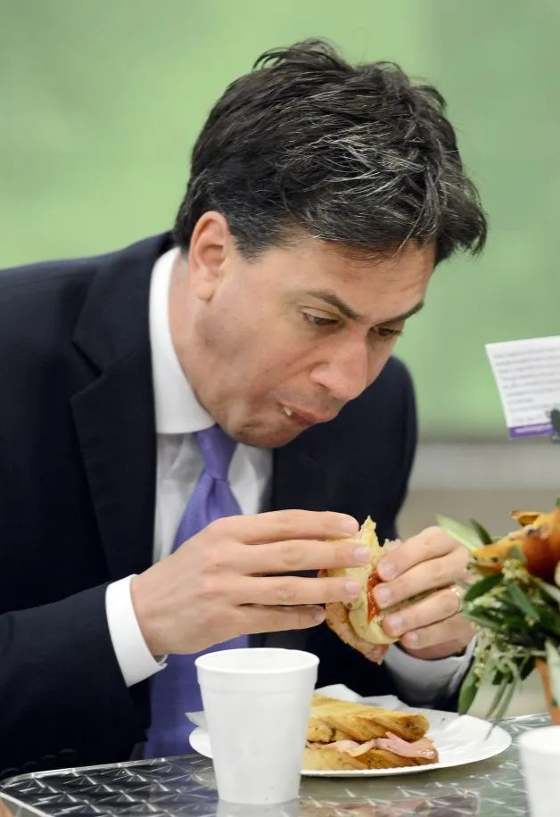
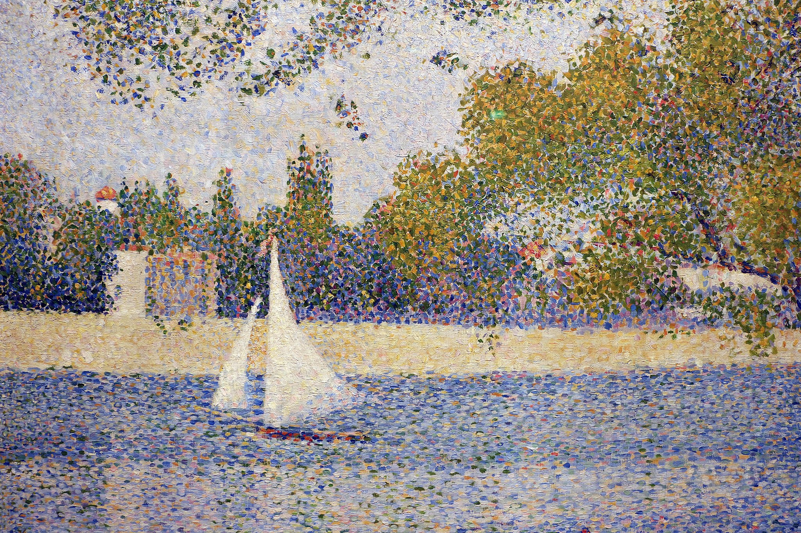
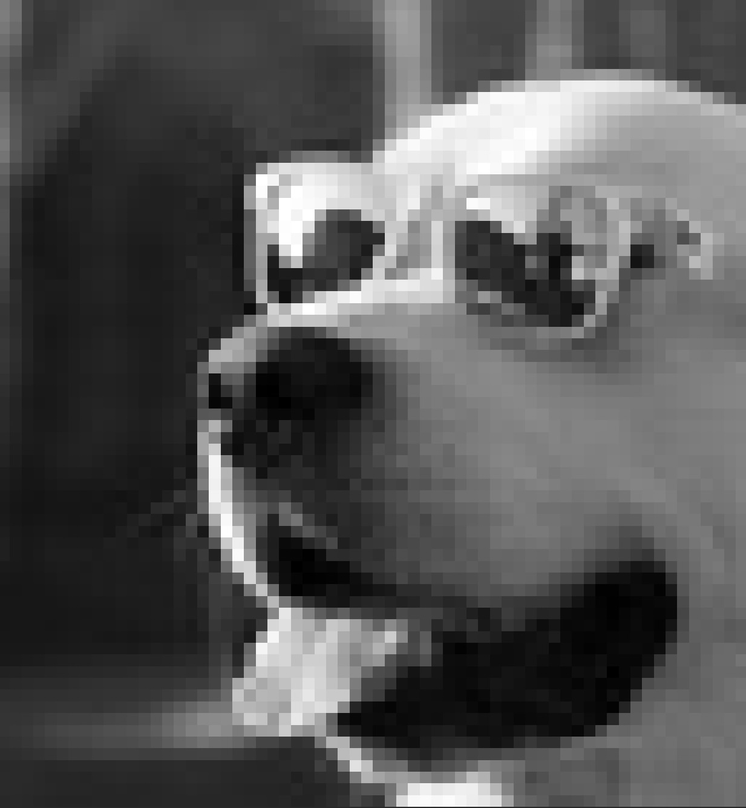
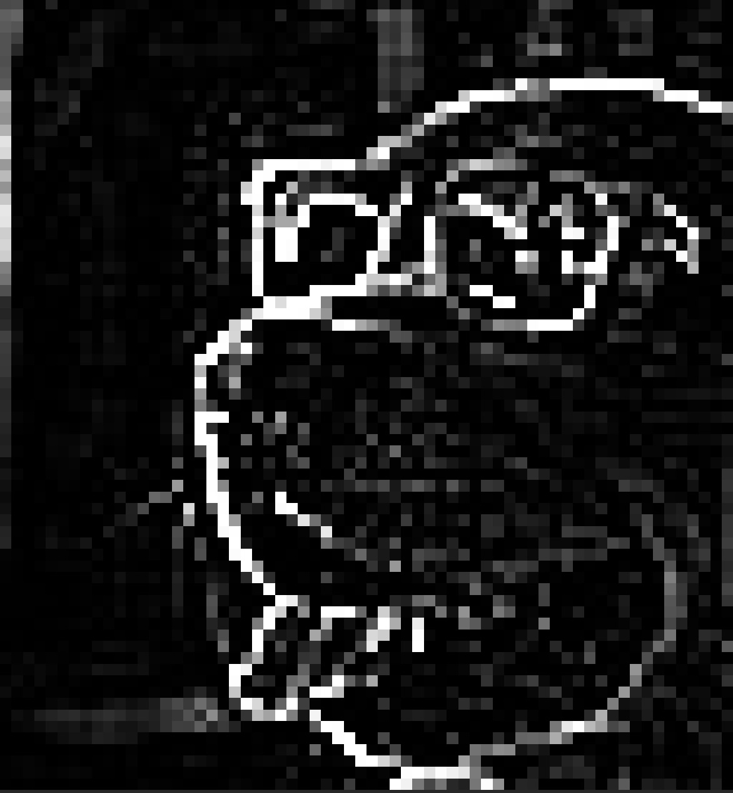
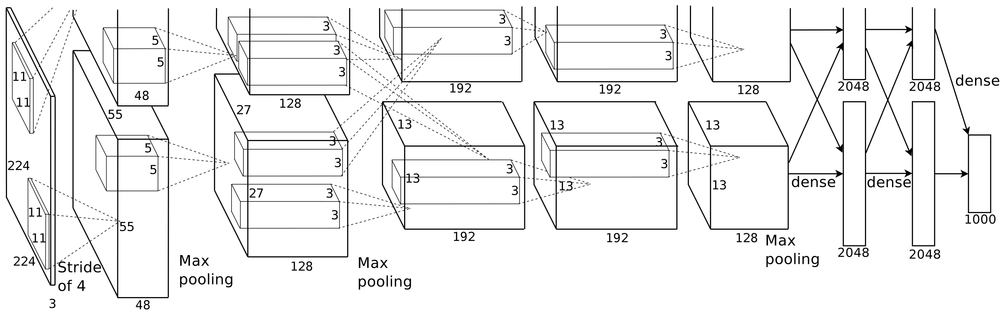

## Midterm assessment

I will release a midterm assignment *this* Thursday

* A small prediction challenge
* Constraints on the size of the network and its structure
* Small space to interpret the results etc.

Should be submitted by **Tuesday 18 August at 9am**

## Warm-up · three questions from last time

[<span class="pause-cue">≈ 5 min</span> · shout it out]{.eyebrow}

::: {.card}

1. Your training loss keeps falling, but your validation loss has started rising. What is happening, and name one fix.
2. A fully-connected layer maps 784 inputs to 128 outputs. How many parameters does it have, counting biases?

:::

## Warm-up · answers

::: {.card}

1. **Overfitting** — the model has started memorising the training set instead of learning the pattern. Any of: add dropout, get more data, stop training early.
2. Each of the 128 outputs has 784 weights and 1 bias:
   $$784 \times 128 + 128 = 100{,}352 + 128 = 100{,}480.$$
:::

# Part 1 · Images as data, then convolutions {background-color="#0E1A2B"}

## What's different about images?

::: {.columns}
::: {.column width="60%"}
Not everything is easily quantified.

* Our experience of the world is sensory.
* Images record aspects that "numbers" can't capture.
* Two principal motivations to use images in research:
  1. They record **unmeasured** dimensions of the world.
  2. They are **less reductive** -- they preserve more about the phenomenon under study.
:::
::: {.column width="40%"}
{width="90%" fig-align="center"}
:::
:::

::: {.card}
For social scientists: protest crowds, ballot tallies, satellite views of land use, MRI scans, facial expressions are all relevant data, but hard to put in a spreadsheet.
:::

## Even (digital) images are quantitative

Strip away the rendering: an image **is** a tensor of numbers.

* Each value is a **pixel** — a single point of light.
* A digital image is a grid of these pixels: an ordered arrangement of numbers.

{fig-align="center"}

[A surprising amount of computer vision is about reasoning with — and over — these grids of numbers.]{.muted}

## Grayscale and colour

::: {.columns}
::: {.column width="50%"}
[Grayscale]{.pill-blue}

* One value per pixel, 0–255 (black → white).
* A $256 \times 256$ grayscale image is a $256 \times 256$ **matrix**.
* So $65{,}536$ integers of light per image.
:::
::: {.column width="50%"}
[Colour (RGB)]{.pill}

* Three values per pixel: red, green, blue
* A $256 \times 256$ colour image is a $256 \times 256 \times 3$ **tensor**
* PyTorch likes to treat the images as shape $(C,H,W)$ rather than $(H,W,C)$


:::
:::

::: {.callout-note}
RGB is one of many ways to encode colour. It's standard because it mimics human trichromatic vision. Other encodings (HSV, CMYK, Lab) exist. 

* A deep-learning pipeline is agnostic to which, as they are all "tensorisable"

:::

## Why deep learning for images? — the brute-force approach

[Suppose we treat the image as a *vector* of features]{.eyebrow}

Can you fit a random forest on a $256 \times 256$ RGB image?

::: {.card}
Yes! 

* **Flatten** it: $256 \cdot 256 \cdot 3 = 196{,}608$ features.
* Train a forest on those features.
* It will work — random forests get ~97% on handwritten digit tasks

But for richer images:

* The feature space is **enormous** — most splits are useless.
* No mechanism for **spatial structure** — that pixel (50, 50) is next to (50, 51) is invisible.
* No mechanism for **translation invariance** — a digit is a digit whether it's centred or off in a corner.
:::

## Fully-connected MLPs suffer from exploding weight matrices

Using week 1's architecture on the same image:

* 196,608 input nodes
* First hidden layer of *just* 128 nodes → $196{,}608 \times 128 = 25{,}165{,}824 \approx 25.2$ **million** weights
* Second hidden layer of 64 nodes → $\approx 1.6$ billion weights

::: {.card}
**Wildly wasteful** -— and trains badly without enormous data

* We also want a model that respects the spatial structure of the input.

:::

## What we want from a vision-friendly architecture

::: {.columns}
::: {.column width="50%"}
[1. Parameter sharing]{.pill}

Learn and apply a *filter* that scans across the space of the image.

  * **Dramatically fewer parameters** as the filter can be much smaller than the image
  * E.g. a 3×3 filter would have only 9 weights
  
:::
::: {.column width="50%"}
[2. Locality]{.pill-blue}

Only look at small patches at a time

* Encodes the idea that "nearby pixels matter together" as a structural component of the model
* Allows us to parallelise the inspection of the image

:::
:::

::: {.card}
**Translation invariance** is possible by virtue of these two properties: if a filter learns to detect an edge, it can do so **anywhere** in the image. 

(Though cf. @biscione2021convolutional for subtleties — CNNs aren't *perfectly* translation-invariant, but they learn to be close.)
:::

## The convolution operator — in pictures

Given an image $\mathbf{A}$ and a small **kernel** $\mathbf{K}$:

1. Slide $\mathbf{K}$ over $\mathbf{A}$
2. At each position, compute the *element-wise* product and sum
3. Return the output value at that position

```{dot}
//| fig-height: 1.8
digraph G {
  rankdir="LR"; bgcolor="transparent"; node [fontname="Inter"];
  A [shape=box label="image A\n(H × W)" style=filled fillcolor="#F4F1EA"];
  K [shape=box label="kernel K\n(k × k)" style=filled fillcolor="#C9322B" fontcolor="white"];
  out [shape=box label="feature map\n((H−k+1) × (W−k+1))" style=filled fillcolor="#F4F1EA"];
  A -> out;
  K -> out [label="slide & sum"];
}
```

::: {.callout-note}
**Convolution vs cross-correlation.** Strictly, "convolution" flips the kernel first. In deep learning we always use cross-correlation but call it convolution. 

* It doesn't matter because the kernels are learned anyway
:::

## Convolution — a small worked example

::: {.columns}
::: {.column width="50%"}
Image and kernel:
$$
\mathbf{A} = \begin{bmatrix} 1 & 2 & 3 \\ 4 & 5 & 6 \\ 7 & 8 & 9 \end{bmatrix}, \quad
\mathbf{K} = \begin{bmatrix} 1 & 0 \\ 0 & 1 \end{bmatrix}
$$

The kernel slides over the image (2×2 window). At each position, compute $\sum K_{ij} A_{ij}$:

* Top-left: $1\cdot1 + 0\cdot2 + 0\cdot4 + 1\cdot5 = 6$.
* Top-right: $1\cdot2 + 0\cdot3 + 0\cdot5 + 1\cdot6 = 8$.
:::
::: {.column width="50%"}
Continuing:

* Bottom-left: $1\cdot4 + 0\cdot5 + 0\cdot7 + 1\cdot8 = 12$.
* Bottom-right: $1\cdot5 + 0\cdot6 + 0\cdot8 + 1\cdot9 = 14$.

Result:
$$
\mathbf{A} \circledast \mathbf{K} = \begin{bmatrix} 6 & 8 \\ 12 & 14 \end{bmatrix}
$$

where $\circledast$ denotes **the convolution operator**.
:::
:::

::: {.card}
**Notice the shrinkage**: the $3 \times 3$ input became a $2 \times 2$ output. A $k \times k$ kernel on an $H \times W$ image gives output size $(H-k+1) \times (W-k+1)$ — unless we **pad** the image with zeros.
:::

## Parameters of a convolution layer

::: {.card}
1. **Kernel size** — typically 3×3, 5×5, 7×7.
2. **Stride** — how far we shift the kernel each step (typically 1).
3. **Padding** — whether to pad image edges with zeros to preserve output size.
4. **Number of filters** — how many *different* kernels we apply in parallel.
:::

::: {.callout-tip}
For a 3×3 kernel with stride 1 and padding 1, the output has the **same** height and width as the input. This "same" padding is what most modern CNNs use.
:::

::: {.card}
[The output-size formula]{.eyebrow}

For an input of height $H$, kernel size $k$, padding $P$ and stride $s$:

$$
\text{out} = \left\lfloor \frac{H + 2P - k}{s} \right\rfloor + 1
$$

(the same formula gives the output width).
:::

## Convolving a colour image

Our worked examples so far were grayscale — one channel. Real photos have three.

::: {.card}
On an RGB input, a "3×3" kernel is a $3 \times 3 \times 3$ block of weights:

1. The kernel has one $3 \times 3$ **slice** per channel.
2. Each slice multiplies its own channel's patch, element-wise.
3. The three per-channel sums are added together, plus the bias → **one** number.
:::

Parameter count for one kernel: $3 \times 3 \times 3 = 27$ weights $+\ 1$ bias $= 28$.

::: {.callout-note}
The output is still a **single** feature map — the channels are summed away. The same rule holds deeper in the network: a 3×3 kernel over a 16-channel input has $3 \cdot 3 \cdot 16 + 1 = 145$ parameters.
:::

## One colour output pixel, by hand

Take one kernel position. Each channel has a $3 \times 3$ patch under the kernel's matching slice — multiply element-wise ($\odot$) and sum:

::: {.columns}
::: {.column width="33%"}
[Red]{.pill}

$$\small \begin{bmatrix} 2 & 0 & 1 \\ 0 & 1 & 0 \\ 1 & 0 & 2 \end{bmatrix} \odot \begin{bmatrix} 1 & 0 & 0 \\ 0 & 1 & 0 \\ 0 & 0 & 1 \end{bmatrix}$$

Sum: $2 + 1 + 2 = 5$
:::
::: {.column width="33%"}
[Green]{.pill-green}

$$\small \begin{bmatrix} 0 & 1 & 0 \\ 1 & 0 & 1 \\ 0 & 1 & 0 \end{bmatrix} \odot \begin{bmatrix} 0 & 1 & 0 \\ 1 & 0 & 1 \\ 0 & 1 & 0 \end{bmatrix}$$

Sum: $1 + 1 + 1 + 1 = 4$
:::
::: {.column width="33%"}
[Blue]{.pill-blue}

$$\small \begin{bmatrix} 1 & 0 & 1 \\ 0 & 2 & 0 \\ 1 & 0 & 1 \end{bmatrix} \odot \begin{bmatrix} 0 & 0 & 0 \\ 0 & 1 & 0 \\ 0 & 0 & 0 \end{bmatrix}$$

Sum: $2$
:::
:::

::: {.card}
Add the channel sums, then the bias ($b = 1$):
$$
5 + 4 + 2 + 1 = 12.
$$
One output pixel. Slide the kernel one position and do it again.
:::

## Deliberate kernels

::: {.columns}
::: {.column width="33%"}
**Sharpen**
$$\small \begin{bmatrix} 0 & -1 & 0 \\ -1 & 5 & -1 \\ 0 & -1 & 0 \end{bmatrix}$$
:::
::: {.column width="33%"}
**Box blur**
$$\small \begin{bmatrix} \tfrac{1}{9} & \tfrac{1}{9} & \tfrac{1}{9} \\ \tfrac{1}{9} & \tfrac{1}{9} & \tfrac{1}{9} \\ \tfrac{1}{9} & \tfrac{1}{9} & \tfrac{1}{9} \end{bmatrix}$$
:::
::: {.column width="33%"}
**Edge detect**
$$\small \begin{bmatrix} -1 & -1 & -1 \\ -1 & 8 & -1 \\ -1 & -1 & -1 \end{bmatrix}$$
:::
:::

::: {.card}
**These are hand-designed kernels** from classical image processing. They produce visibly recognisable effects.

In a CNN we don't hand-design them. Instead, we *learn* them, just like any other weights, via backpropagation.
:::

## Edge-detection in practice

{width="35%"} $\circledast$ edge-detect kernel $=$ {width="35%"}

::: {.callout-tip}
**What the network learns** is rarely a "pure" edge detector. Instead it converges on dozens of specialised kernels that mix sharpening, blurring, contrasting, colour selection — whatever turns out to be useful for reducing the loss.
:::

## Why kernels generalise — translation invariance

::: {.card}
A 3×3 kernel "looks for" a specific local pattern. If the pattern appears **anywhere** in the image, the kernel's output is high *at that location*.

The same 9 weights detect that pattern in the corner, in the centre, at the edge — anywhere.

This is the trick that takes us from 25 million weights to **≈30 weights per filter**.
:::

## Stop and take stock

[<span class="pause-cue">Stop & check</span>]{.eyebrow}

::: {.try-box}
[Try — 60 seconds in pairs]{.try-label}

A 28×28 grayscale image (MNIST). A single 3×3 convolution layer with 32 filters and "same" padding.

**How many parameters does that layer have? How big is the output?**
:::

::: {.fragment}
::: {.reveal-box}
[Answer]{.reveal-label}
Each filter has $3 \times 3 = 9$ weights + 1 bias = 10 parameters. With 32 filters, that's **320 parameters**.

Output shape: $28 \times 28 \times 32$ — same spatial size, but now 32 channels (feature maps), one per filter.

Compare to the fully-connected version, which would have $784 \cdot 32 = 25{,}088$ weights (78× more). And that's just for the first layer.
:::
:::

# Plenary · design a kernel by hand {background-color="#0E1A2B"}

## Plenary · design a kernel

[<span class="pause-cue">≈ 10 min</span> · in pairs]{.eyebrow}

::: {.card}
[Design challenge]{.eyebrow}

**Your task**: design a 3×3 kernel that detects **vertical edges** in a grayscale image.

That is, the output should be large (positive) where there's a strong vertical line of dark-to-light transition, and zero elsewhere.

[Steps]{.eyebrow}

1. Sketch the kernel.
2. Apply it to this small 3×3 patch:
$$
\begin{bmatrix} 0 & 128 & 255 \\ 0 & 128 & 255 \\ 0 & 128 & 255 \end{bmatrix}
$$
3. What if you had **no** edge in the patch?
:::

## Plenary · one defensible answer

::: {.card}
[A vertical-edge kernel]{.eyebrow}

$$
\mathbf{K} = \begin{bmatrix} -1 & 0 & 1 \\ -1 & 0 & 1 \\ -1 & 0 & 1 \end{bmatrix}
$$

* Multiplies the **left column** of the patch by $-1$, the **right column** by $+1$.
* If left is dark (0) and right is bright (255), output is large positive.
* If left and right are the same (no edge), the outputs cancel — output is zero.
:::

::: {.card}
[On the test patch]{.eyebrow}

Each row contributes $(0)(-1) + (128)(0) + (255)(1) = 255$. Sum the three rows:

$$
\text{output} = 255 + 255 + 255 = (255 - 0) \times 3 = 765.
$$

[On an all-128 patch]{.eyebrow} Each row gives $(128)(-1) + (128)(0) + (128)(1) = 0$ → output = 0. Correctly zero.

::: {.callout-tip}
This is the **Prewitt operator**, a classical edge detector.
:::
:::

# Part 2 · From convolutions to a CNN {background-color="#0E1A2B"}

## The CNN pipeline

::: {.card}
1. Apply **many kernels** in parallel → produce a stack of **feature maps**.
2. **Pool** — shrink each map to keep the strongest signal.
3. Repeat (1) and (2). Each successive layer sees a coarser, deeper representation.
4. **Flatten** the final stack into a vector.
5. Pass through one or more **fully-connected layers**.
6. Output layer with **softmax** → class probabilities.
:::

This is the basic recipe behind LeNet (1989), AlexNet (2012), and most CNNs since.

## Feature maps

A single kernel can't detect every useful feature. Stack many of them:

* Apply $m$ kernels to the input image, in parallel.
* Each yields one **feature map** of the original spatial size.
* A grayscale $64 \times 64$ image becomes a $64 \times 64 \times m$ tensor of feature maps.
* Each entry in a feature map is a **unit** — one number, produced at one spatial position by one filter. It's the CNN's analogue of a neuron.

::: {.card}
**Channels increase over successive convolutions.**
RGB images start at 3 channels. After conv layer 1 you might have 32. After layer 2: 64. 

* Conversely, the **height** and **width** (spatial dimensions) shrink.

:::

## How the kernels get learned

::: {.card}
* Kernels start as random numbers
* Gradient descent updates each kernel weight to reduce the loss
  
  * The same rule as any other parameter in the network
  
* Whatever local patterns help the network classify, the kernels converge towards

:::

What do they converge to? 

* In trained networks, first-layer kernels often come out as **edge detectors** and **colour-blob detectors**


## What deeper layers respond to

@zeiler2014visualizing projected each layer's activations back to pixel space to see what "excites" them:

::: {.columns}
::: {.column width="50%"}
[Early layers]{.pill-blue}

* **Layer 1** — edges and colour blobs.
* **Layer 2** — textures: stripes, grids, corners.
:::
::: {.column width="50%"}
[Later layers]{.pill-amber}

* **Layers 3–4** — object parts: wheels, eyes, dog faces.
* **Layer 5** — whole objects: keyboards, birds, people.
:::
:::

::: {.card}
Each layer builds its features from the layer below: edges combine into textures, textures into parts, parts into objects. This sequence appears from training alone.
:::

## Pooling

After convolution, we **pool** the results to shrink the spatial dimensions:

* **Max pooling** — keep the maximum value in each $2 \times 2$ window. Most common.
* **Average pooling** — keep the mean.

::: {.card}
**Why pool?** 

  * It compresses information 
  * Adds robustness to small spatial shifts (a digit that wobbles by a pixel is still a digit)
  * Reduces compute downstream
  
:::

## Max pooling — by example

Feature map ($4 \times 4$), pool size $2 \times 2$, stride 2:

$$
\begin{bmatrix}
\color{#C9322B}{1} & \color{#C9322B}{3} & \color{#1A6FB4}{6} & \color{#1A6FB4}{4} \\
\color{#C9322B}{9} & \color{#C9322B}{3} & \color{#1A6FB4}{1} & \color{#1A6FB4}{5} \\
\color{#2F8F6C}{5} & \color{#2F8F6C}{5} & \color{#C58A12}{8} & \color{#C58A12}{2} \\
\color{#2F8F6C}{3} & \color{#2F8F6C}{1} & \color{#C58A12}{5} & \color{#C58A12}{6}
\end{bmatrix}
\quad \rightarrow \quad
\begin{bmatrix}
\color{#C9322B}{9} & \color{#1A6FB4}{6} \\
\color{#2F8F6C}{5} & \color{#C58A12}{8}
\end{bmatrix}
$$

Each colour group is one pooling window. Keep only the **max** in each.

## A fully worked CNN sketch

Input: $32 \times 32 \times 3$ image (CIFAR-style).

| Layer | Output shape | Parameters (incl. biases) |
|---|---|---|
| Conv 1 (3×3, 16 filters, padding 1) | $32 \times 32 \times 16$ | $(3 \cdot 3 \cdot 3 + 1)\cdot 16 = 448$ |
| ReLU | $32 \times 32 \times 16$ | 0 |
| MaxPool (2×2) | $16 \times 16 \times 16$ | 0 |
| Conv 2 (3×3, 32 filters, padding 1) | $16 \times 16 \times 32$ | $(3 \cdot 3 \cdot 16 + 1)\cdot 32 = 4{,}640$ |
| ReLU + MaxPool | $8 \times 8 \times 32$ | 0 |
| Flatten | $1 \times 2048$ | 0 |
| Linear (2048 → 64) | $1 \times 64$ | $2048 \cdot 64 + 64 = 131{,}136$ |
| ReLU + Linear (64 → 10) | $1 \times 10$ | $64 \cdot 10 + 10 = 650$ |
| Softmax | $1 \times 10$ | 0 |

::: {.callout-note}
**Every row includes a bias term** (the $+1$ per filter, the $+64$ and $+10$ per linear layer).

Notice also that **most parameters live in the first fully-connected layer** ($131{,}136$); the convolutions are compact as a result of parameter sharing.

:::

## Receptive fields

How much of the image feeds into any given unit in a feature map?

  * Notice deeper convolutions never "see" the image inputs themselves

::: {.card}
The **receptive field** of a unit is the patch of the input that can affect its value.
:::

* After one $3 \times 3$ convolution, each unit sees a $3 \times 3$ patch.
* Stack a second $3 \times 3$ convolution in the next layer, the unit sees $5 \times 5$

  * With stride 1, neighbouring layer-1 windows overlap — so the view grows by 2 per layer, not 3
  
* The third layer then is $7 \times 7$ etc.

For stride-1 convolutions with kernel size $k$:

$$
\text{receptive field} = \text{layers} \times (k - 1) + 1
$$

Check: $2 \times (3 - 1) + 1 = 5$; $\ 3 \times (3 - 1) + 1 = 7$.

## Why stack small kernels?

::: {.try-box}
[Try it yourself]{.try-label}
**How many stacked $3 \times 3$ layers does a unit need to see a $15 \times 15$ patch?**
:::

::: {.fragment}
::: {.reveal-box}
[Answer]{.reveal-label}
Solve $\text{layers} \times (3 - 1) + 1 = 15$: $\text{layers} = 14 / 2 = 7$.
:::
:::

::: {.card}
[VGG (2014) chose small kernels]{.eyebrow}

Two ways to see a $7 \times 7$ patch (single channel, biases included):

* One $7 \times 7$ kernel: $49 + 1 = 50$ parameters.
* Three stacked $3 \times 3$ kernels: $3 \times (9 + 1) = 30$ parameters — with two extra activation functions along the way.

Fewer parameters *and* more non-linearity.

:::

## Pooling widens the view

Stacked convolutions grow the receptive field slowly — seven layers to reach $15 \times 15$.

Pooling speeds this up. After a $2 \times 2$ stride-2 pool, each pixel in the pooled map spans **two** pixels of the map below, so every later layer's view doubles.

::: {.card}
Receptive field along a conv–pool–conv–pool–conv chain (all convs $3 \times 3$):

$$
3 \;\xrightarrow{\text{pool}}\; 4 \;\xrightarrow{\text{conv}}\; 8 \;\xrightarrow{\text{pool}}\; 10 \;\xrightarrow{\text{conv}}\; 18
$$

Three $3 \times 3$ convolutions and two pools see an $18 \times 18$ patch — over half the width of a $32 \times 32$ CIFAR image. The same three convolutions without pooling: $7 \times 7$.
:::

## The 1×1 convolution — what could it possibly do?

::: {.try-box}
[Try — 60 seconds in pairs]{.try-label}

Modern CNNs are full of **1×1 convolutions**. A 1×1 kernel sees a single pixel — no neighbourhood at all.

**What could it possibly compute? And how many parameters does one 1×1 filter have on a 64-channel input?**
:::

::: {.fragment}
::: {.reveal-box}
[Answer]{.reveal-label}
On a 64-channel input, a "1×1" kernel is really a $1 \times 1 \times 64$ block: $64$ weights $+\ 1$ bias $= 65$ parameters — the same channel rule as every other kernel.

It mixes **channels**, not space. At each position it takes the 64 channel values and returns one weighted sum: a fully-connected layer, applied pixel by pixel.
:::
:::

::: {.card}
The standard use is **cheap channel reduction**: squeezing 64 feature maps down to 16 costs $(1 \cdot 1 \cdot 64 + 1) \cdot 16 = 1{,}040$ parameters, and the spatial dimensions are untouched. ResNets and most modern CNNs use them for exactly this.
:::

## Training a CNN — same algorithm, different graph

The convolution operation has a well-defined gradient. Everything from week 1 still applies:

::: {.card}
* **Forward pass** → compute loss.
* **Backward pass** → propagate gradients through every conv, pool, and linear layer.
* **Update** parameters (kernels and biases) with Adam / SGD.

Pooling layers have **no parameters** but they do have gradients (the gradient passes through the position of the max, zero elsewhere). The learning happens in the **convolutions** and the **fully-connected layers**.
:::

## AlexNet — the model that started "deep learning"

::: {.columns}
::: {.column width="60%"}
* @Krizhevsky2012 — ImageNet competition, 2012
* 8 layers, ~60M parameters
* First widely-known model to train deep CNNs on a **GPU**
* Beat the previous year's ImageNet leader by **10+ accuracy points**
* Used ReLU and dropout (unusual at the time)

::: {.card}
This is the result that kicked off the modern deep learning era. Everything after — ResNets, vision transformers, multimodal models, diffusion — descends from this work
:::
:::
::: {.column width="40%"}
{fig-align="center"}
:::
:::

# Activity · compute output shapes {background-color="#0E1A2B"}

## Activity · compute output shapes

[<span class="pause-cue">≈ 8 min</span> · in pairs]{.eyebrow}

For each scenario, give the **output shape** after the operation and the **number of parameters**:

::: {.card}
1. Input: $28 \times 28 \times 1$ (grayscale MNIST).
   Conv: 5×5, 6 filters, stride 1, no padding.

2. Input: $14 \times 14 \times 6$ (after pooling).
   Conv: 3×3, 16 filters, stride 1, "same" padding (= 1).

3. Input: $7 \times 7 \times 16$.
   MaxPool: 2×2 with stride 2.

4. Input: $4 \times 4 \times 16$.
   Flatten, then `Linear(?, 10)`.
:::

[Five minutes. Then we'll discuss.]{.muted}

## Activity · answers

::: {.card}
1. Conv output: $(28 - 5 + 1) \times (28 - 5 + 1) \times 6 = 24 \times 24 \times 6$. Parameters: $(5 \cdot 5 \cdot 1 + 1) \cdot 6 = 156$.

2. Conv output: $14 \times 14 \times 16$ (same padding preserves spatial size). Parameters: $(3 \cdot 3 \cdot 6 + 1) \cdot 16 = 880$.

3. MaxPool: apply the output-size formula with $k = s = 2,\ P = 0$: $\lfloor (7 - 2)/2 \rfloor + 1 = \lfloor 2.5 \rfloor + 1 = 3$, so $3 \times 3 \times 16$. Parameters: 0.

4. Flatten: $4 \cdot 4 \cdot 16 = 256$. So `Linear(256, 10)` has $256 \cdot 10 + 10 = 2{,}570$ parameters.
:::

::: {.callout-tip}
**Shape mismatches** are the top source of CNN bugs. PyTorch's error messages are usually good, but debugging at runtime is slow.
:::

# Part 3 · CNNs in social science {background-color="#0E1A2B"}

## When CNNs help, when they don't

::: {.columns}
::: {.column width="50%"}
[Good fit]{.pill-green}

* Tasks where local visual features matter (handwriting, faces, satellite imagery, microscopy).
* Spatial structure dominates the signal.
* Reasonable amount of labelled data ($10^3$–$10^6$ images).
:::
::: {.column width="50%"}
[Awkward fit]{.pill-amber}

* Very small datasets (a few hundred images).
* Tasks where global structure matters more.
* Tasks dominated by *non-spatial* signal — text in the image, metadata.

In 2026, **vision transformers** (ViTs) often outperform CNNs at the high end. For teaching and most research, CNNs remain the right starting point.
:::
:::

## Application 1 — Reading vote tallies

::: {.columns}
::: {.column width="55%"}
@torres2022learning — *Learning to See: CNNs for the Analysis of Social Science Data*.

* In many countries, vote counts are first written by hand on paper tally sheets.
* Errors during manual transcription are a real risk.
* The authors train a CNN to **read** handwritten tally numbers — significantly reducing transcription errors.

::: {.card}
The architecture is **LeNet** — the 1989 model — with modern training. The contribution isn't novel deep-learning architecture; it's the *social-science use case* and the careful validation.
:::
:::
::: {.column width="45%"}
::: {.callout-tip}
**The takeaway**: a 37-year-old architecture, when applied to a well-defined social-science problem, can have substantial real-world impact.

You don't need the bleeding edge to do meaningful work.
:::
:::
:::

## Application 2 — Visual frames in protest photography

::: {.columns}
::: {.column width="55%"}
@torres2024framework — *A framework for the unsupervised and semi-supervised analysis of visual frames*.

* What "frames" do protest photos use — heroic individuals? police violence? crowd shots?
* The author uses CNN feature embeddings + clustering to discover frames without labels.
* Connects to a long literature in political communication on framing.
:::
::: {.column width="45%"}
::: {.card}
The deep network here serves as a **feature extractor** — its hidden representations become the inputs to a classical analysis.

This is a very common pattern: pre-train (or download) a CNN, then use its embeddings for *your* task.

We see this again with text embeddings on Day 8.
:::
:::
:::

## Application 3 — Satellite imagery for development economics

::: {.columns}
::: {.column width="55%"}
A rich modern research area:

* **Predicting GDP / poverty from night lights** (Henderson, Storeygard, Weil 2012, originally with simple regression — extended by CNNs).
* **Tracking deforestation** from time-series of satellite images.
* **Measuring urbanisation** from change in building footprints.
* **Monitoring food security** from crop reflectance.
:::
::: {.column width="45%"}
::: {.callout-tip}
Most of these projects use **transfer learning** — start with a CNN pre-trained on ImageNet, fine-tune on the satellite data.

This is feasible on a modest GPU. (The hard part is the data labelling, not the deep learning.)
:::
:::
:::

## Transfer learning — you don't have 14 million images

The realistic research situation: you have **2,000 labelled protest photos**. ImageNet has **14 million** images. A CNN trained from scratch on 2,000 photos will overfit long before it learns what an edge is.

::: {.card}
An ImageNet-trained CNN has already learned edges, textures, and object parts — and none of that is specific to ImageNet's classes.

**Transfer learning**: keep (**freeze**) the pre-trained convolutional layers, and retrain only a new **output head** on your own labels.
:::

The frozen convolutional stack becomes a fixed feature extractor — the same pattern as Application 2, where CNN embeddings fed a clustering analysis.

## Transfer learning — the arithmetic

Take **ResNet-18**, a standard pre-trained CNN with about 11.7M parameters. Its convolutional stack maps any image to a 512-dimensional feature vector.

::: {.card}
A new head for three protest-frame classes is `Linear(512, 3)`:

$$
512 \times 3 + 3 = 1{,}536 + 3 = 1{,}539 \ \text{trainable parameters}
$$

That is $1{,}539 / 11{,}700{,}000 \approx 0.01\%$ of the network. Your 2,000 photos train 1,539 numbers, not 11.7 million.
:::

## Fine-tuning — three regimes

In increasing order of ambition:

::: {.card}
| Regime | What trains | Trainable parameters (ResNet-18, 3 classes) |
|---|---|---|
| **Feature extraction** | the new head only | $1{,}539$ |
| **Partial fine-tuning** | head + the last conv block | $\approx 8.4$M |
| **Warm starting** | everything | $\approx 11.7$M |
:::

* In every case the network **starts from the pre-trained weights** — only the head is random.
* "Warm starting" is ordinary training with a better-than-random initialisation

## Which regime? Ask two questions

1. **How much labelled data do you have?**
2. **How similar are your images to the pre-training data?**

::: {.card}
| | Looks like ImageNet | Looks nothing like it |
|---|---|---|
| **Little data** ($100-1000s$) | freeze; train a new head | freeze the early layers; fine-tune the later ones |
| **Lots of data** ($100,000s$+) | warm-start the whole network | warm-start — or train from scratch |
:::

* Early layers detect edges and textures, useful for *any* image
* Later layers detect ImageNet-specific parts — dog faces, keyboards. 
* The further your images sit from ImageNet, the deeper you have to retrain [@yosinski2014transferable].

## Fine-tuning without wrecking the weights

A few over-sized gradient steps during fine-tuning will destroy existing weights

::: {.card}
* Fine-tune with a **much smaller learning rate** than you would use from scratch — $10^{-5}$ to $10^{-4}$.
* *Or* (often better) use **one learning rate per part**: the head is random, so let it move; the backbone only needs a nudge.
:::

```python
model = torchvision.models.resnet18(weights="IMAGENET1K_V1")
model.fc = nn.Linear(512, 3)                        # new, random head

backbone = [p for n, p in model.named_parameters() if not n.startswith("fc.")]
optimiser = torch.optim.Adam([
    {"params": model.fc.parameters(), "lr": 1e-3},  # random → move fast
    {"params": backbone,              "lr": 1e-5},  # pre-trained → tread carefully
])
```

::: {.callout-warning}
**One trap.** Setting `requires_grad = False` freezes a layer's *weights*, but batch-norm layers still update their running mean and variance in training mode... You really need to run this part of the network under `.eval()`.
:::

## A research framing — the right question to ask

::: {.card}
It won't be surprising that we *can* classify images using CNNs.

The real questions when developing these models are:

* **What does the CNN's mistake pattern reveal about the underlying construct?**
* **How robust is the measurement to camera angle, lighting, demographics?**
* **What does the CNN encode about race / gender / class — that we did not ask it to?**
* **What does this measurement, scaled up, *do* to the population being measured?**
:::

::: {.callout-warning}
A model that classifies tally sheets with 99.5% accuracy is interesting. A model with 88% accuracy that systematically misreads tallies from one ethnic group is *important to investigate before deployment*.
:::
## Where was the model looking?


::: {.card}
[Occlusion sensitivity — @zeiler2014visualizing again]{.eyebrow}

1. Classify the image once; note the probability of the true class.
2. Slide a grey square across the image, one position at a time.
3. Re-classify at every position and record how far the probability falls.
4. Plot the falls as a heat map

Where the probability collapses pinpoints what evidence it uses to classify well.

:::

::: {.card}
[The cautionary tale]{.eyebrow}

@ribeiro2016why demonstrate a husky-vs-wolf classifier that scores well on held-out photos. 

*But*:

* Checking *where it looked* revealed it was a **snow detector**: 

  * Training photos almost always showed wolves with snowy backgrounds.

CNN classifiers can have excellent validation for the wrong reasons.

* Well worth checking where the model looks *before* you trust the accuracy
:::

[Cf. gradient-based refinements like saliency maps, Grad-CAM, which help make efficient this inspection.]{.muted}


## A small ethics moment

[Example of poor CNN usage]{.eyebrow}

::: {.card}
**Facial recognition deployed by law enforcement**, using the same CNN architectures we've been discussing.

Buolamwini & Gebru (2018) show commercial **gender-classification** systems had error rates of **<1% on white men** and **>30% on dark-skinned women**. 

* The architectures were not different but the **training data** was

By 2020 several US cities had banned police use of facial recognition

**Be mindful of your applications** -- working with images (of humans) is much more ethically tricky, and we should be as responsible as we can be.

:::

## Take stock

[<span class="pause-cue">Where you are at the end of Day 6</span>]{.eyebrow}

::: {.card}
You can:

1. Describe what a digital image *is* to a computer.
2. Explain why a fully-connected MLP is the wrong architecture for vision.
3. Compute a small convolution by hand.
4. Design a 3×3 kernel that detects a specific feature.
5. Build a small CNN by stacking conv + ReLU + pool, plus an FC head.
6. Cite at least two social-science applications of CNNs and the questions they raise.
7. Choose between feature extraction, partial fine-tuning and warm starting — and pick learning rates that protect the pre-trained weights.
8. Use occlusion sensitivity to check *where* a model is looking before trusting its accuracy.
:::

# Lab brief · today's afternoon {background-color="#0E1A2B"}

## Today's lab — 90 minutes

[Goals]{.eyebrow}

In Colab, train a small CNN on **FashionMNIST** — 28×28 grayscale images of clothing, ten classes.

The core (Sections 1–3):

1. Use the output-size formula to design the network — the same arithmetic as today's activity.
2. Build a small CNN (2 conv layers + 2 FC layers), counting parameters with biases as you go.
3. Train it with the Lab 5 loop, now on batches.

::: {.card}
[Stretch (Section 4) — look inside the network]{.eyebrow}

* Inspect the predictions it gets wrong, and the confusion matrix.
* **Plot the learned first-layer filters.** Do any look like edge detectors?
* Compare against an MLP baseline of similar size — does the convolution actually help?
:::

## See you tomorrow {background-color="#0E1A2B"}

[Lecture 7 — *Generating images: autoencoders, VAEs, and diffusion*]{.eyebrow}

Move from *classifying* images to *creating* them. 

* Start with the **autoencoder** 
* Move to **variational autoencoders** 
* And then to **diffusion** models behind DALL·E etc.

Convolutions remain critical throughout!

::: {.callout-tip}
## Optional reading before tomorrow
* Goodfellow, Bengio & Courville — *Deep Learning* — Chapter 14 (autoencoders, skim).
* Recall **MIDAS** from Lecture 1 — denoising autoencoders for missing survey data — a generative method you'll now understand from the inside.
:::
